# Tutorial 1: Viewing T-BAS trees, alignments, and specimen metadata
1. In this tutorial we will be using the Ramularia reference tree as an example to illustrate the features available when viewing trees in T-BAS. To begin, go to the T-BAS start page (https://tbas.hpc.ncsu.edu/start) and click on the T-BAS Trees button (see arrow).
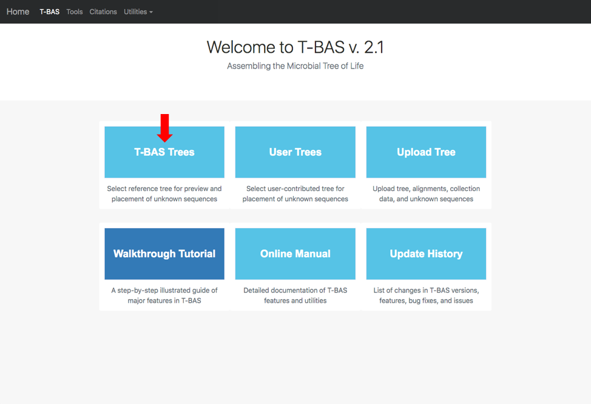

2. Click on the blue bullet to select the Ramularia reference tree.  Note only trees with a solid blue bullet in the guide tree contain data.
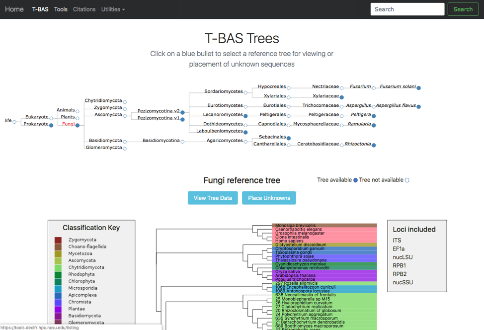

3. The Ramularia tree is now highlighted in red.  Below the guide tree are options (blue buttons) for View Tree Data (i.e., viewing/downloading of tree, alignments and specimen metadata), and Place Unknowns (i.e., phylogenetic placement of unknown sequences).
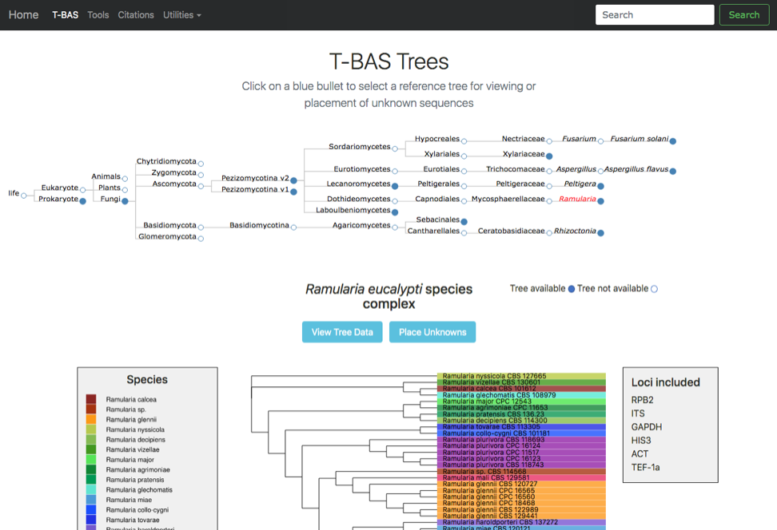

4. Clicking on the View Tree Data button on previous page will open up a new tab with the Ramularia tree. At the top of the left side pane are buttons for help (tutorials), new data (to place unknown sequences on tree), update metadata (to upload new specimen metadata), color editor (to assign new colors to attributes in tree), color reset (to restore colors to default settings), reset defaults (to restore default settings; if your settings do not show the defaults shown in the screenshots in this tutorial, hit reset defaults) and select by list (to upload a file with a list of taxa to highlight in tree). Entering text in the Search box will search for the name across all tree data and display it in red.  The options under Highlighted taxa are available when user selects a leaf or clade in the tree or taxa are selected from an uploaded list.  Note the default settings are Layout (radial), Format (FASTA - aligned), and Sequence (RPB2) in this example.  There are subheadings under Sequence if the user wants to view each locus separate or multiple loci concatenated.
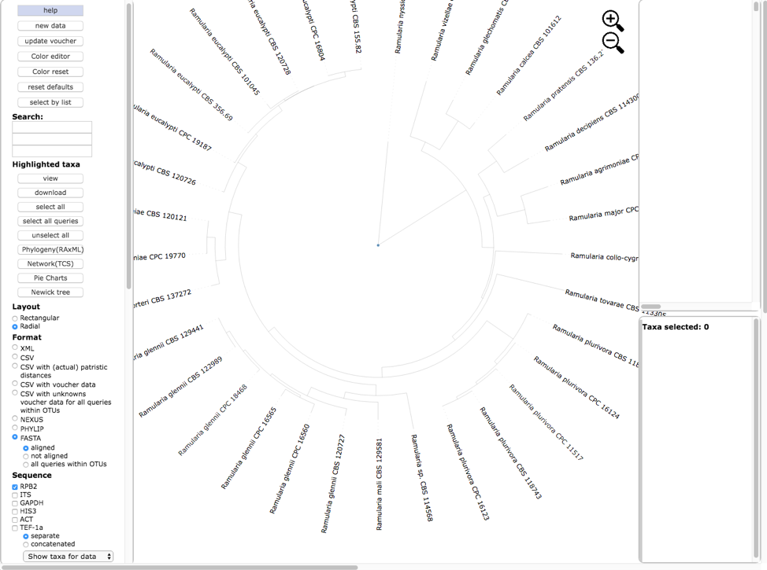
Text options include italicize names and adjusting font size. The Colorize Leaves option will colorize the outer leaves of the tree according to specimen metadata by selecting from the pull down.  Additional outer rings (i.e. bands) can be added – up to a maximum of 12 by clicking on the more+ option. Colors can be applied to the background or text. Additional options will Colorize Branches and the Width of branch lines can be adjusted. Bootstrap values can be displayed on branches or by thickening the lines in the tree for a specified bootstrap threshold value. Edge numbers are used when placing unknowns in T-BAS (see Tutorial 2). Branch lengths are by default drawn to scale. Trees and legend can be Exported separately and combined as PNG, SVG, PDF, and multipage PDF.

5. Scroll to the bottom of the left side pane to see additional options. Under the Sequence heading and immediately below the separate and concatenated alignment options is a pull down for Show taxa for data (to highlight taxa for different locus combinations) and below the pull down are the alignment default viewing options: remove taxa with no data, remove sites with all gaps, and remove unalignable regions; to view more or less alignment data, check or uncheck one or more of these boxes. The Display section provides options to colorize all leaves, colorize excluding singletons and colorize only singletons. Legends would normally appear in the right-side pane in a single column if Show 1 column legend is checked (e.g. see step 6); unchecking will display legends side by side. Colors can be shown with no transparency.
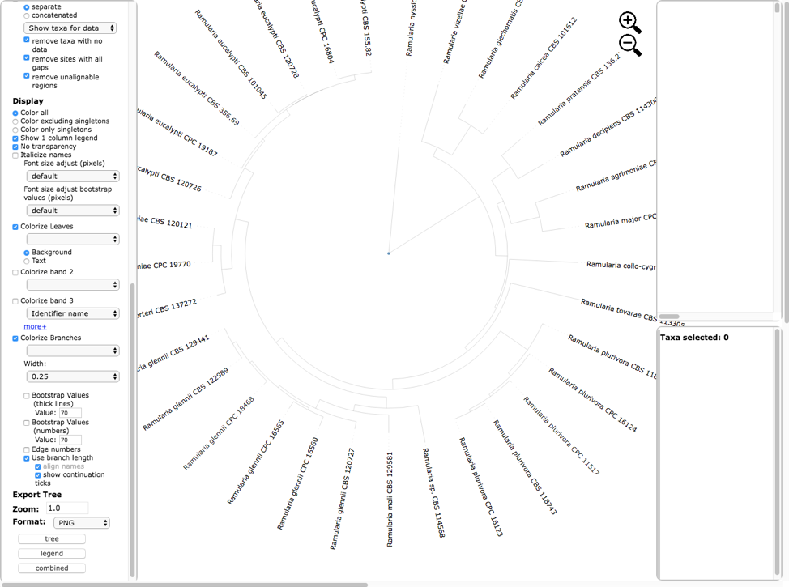
Text options include italicize names and adjusting font size. The Colorize Leaves option will colorize the outer leaves of the tree according to specimen metadata by selecting from the pull down.  Additional outer rings (i.e. bands) can be added – up to a maximum of 12 by clicking on the more+ option. Colors can be applied to the background or text. Additional options will Colorize Branches and the Width of branch lines can be adjusted. Bootstrap values can be displayed on branches or by thickening the lines in the tree for a specified bootstrap threshold value. Edge numbers are used when placing unknowns in T-BAS (see Tutorial 2). Branch lengths are by default drawn to scale. Trees and legend can be Exported separately and combined as PNG, SVG, PDF, and multipage PDF. The Zoom shows the default tree magnification of 1.0, which can be adjusted by clicking the  icons.

6. Below is the tree resized and formatted with the following options selected. Magnification reduced by clicking multiple times on  or panning with mouse until Zoom=0.5220 (or enter the value in the box and press enter), Font size +6, Font size bootstrap +5, Colorize leaves by Species, Colorize band 2 by Country, Colorize Branches by Species, set branch Width to 2, show bootstrap values with thick lines, and show bootstrap values (numbers). The branch lengths are drawn to scale. The legends are displayed in the dashboard window on the right.

7.
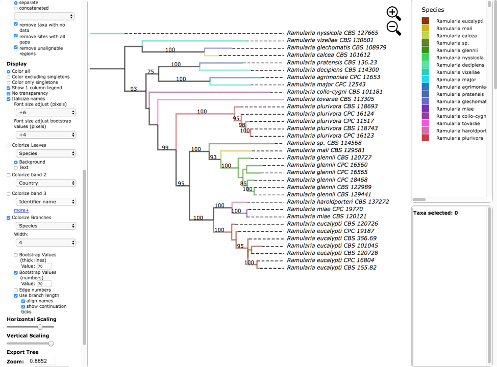

8.
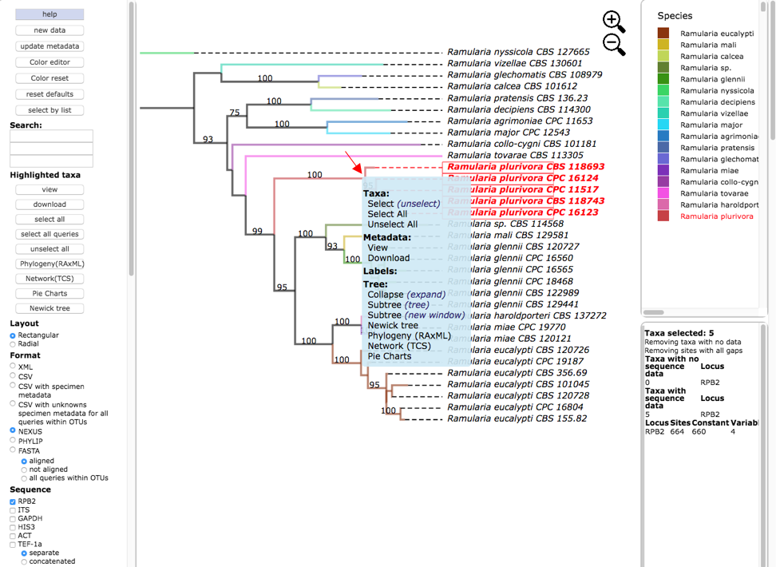

9.
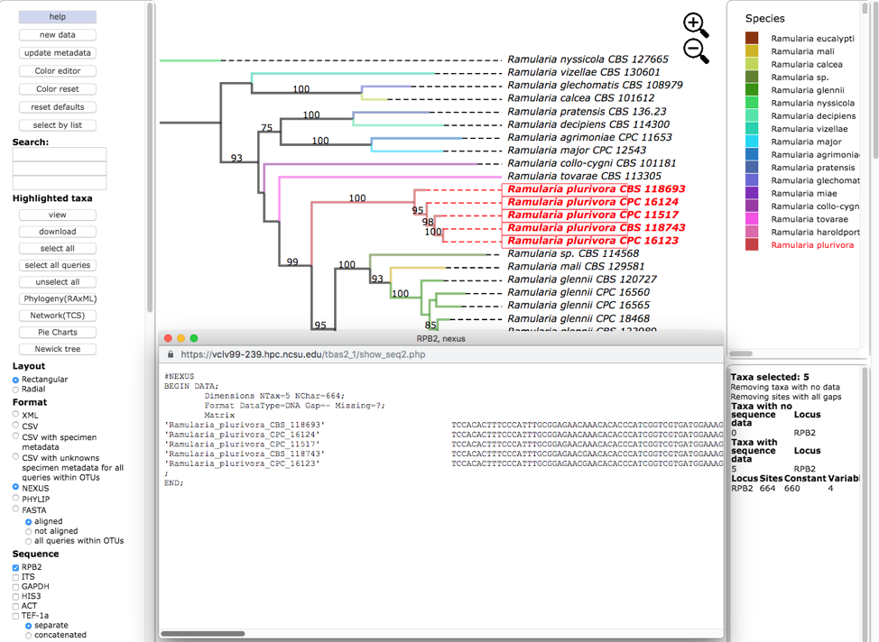

10.
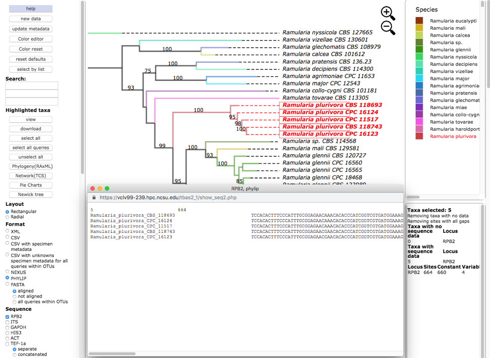

11.
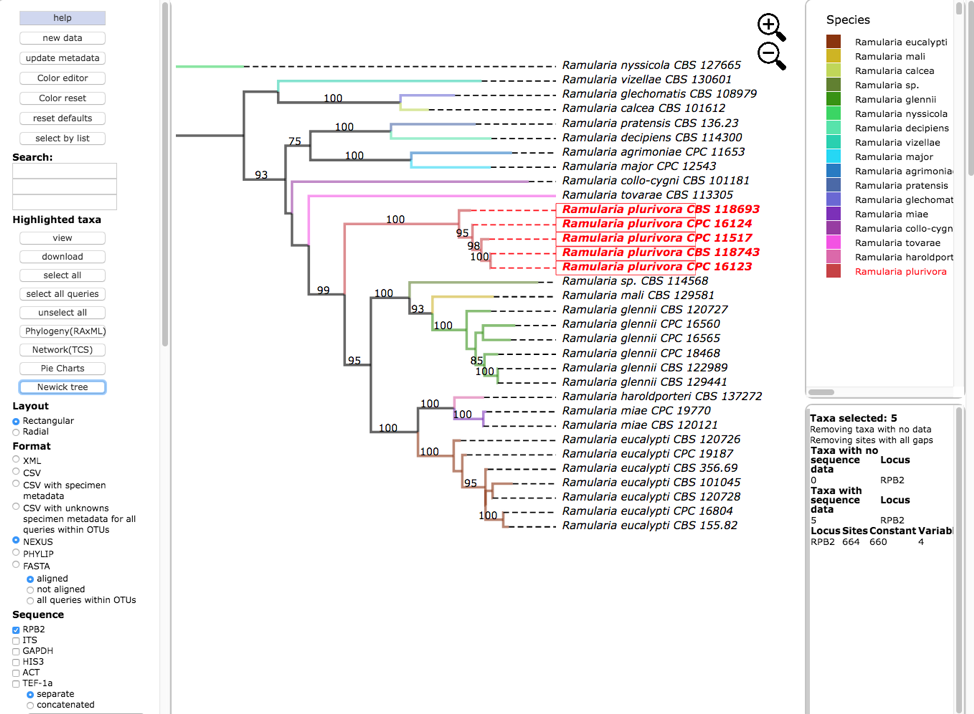

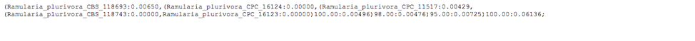

12.
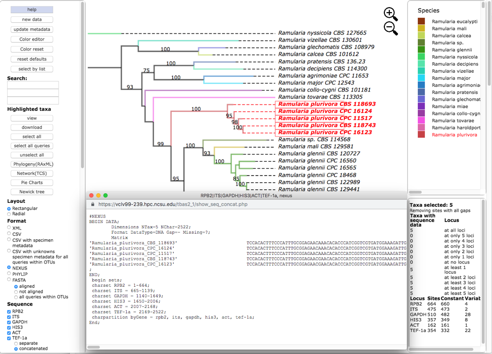

13.
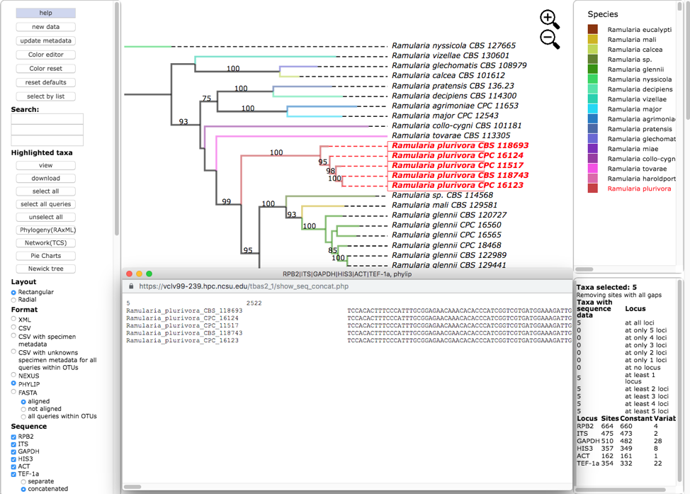

14.
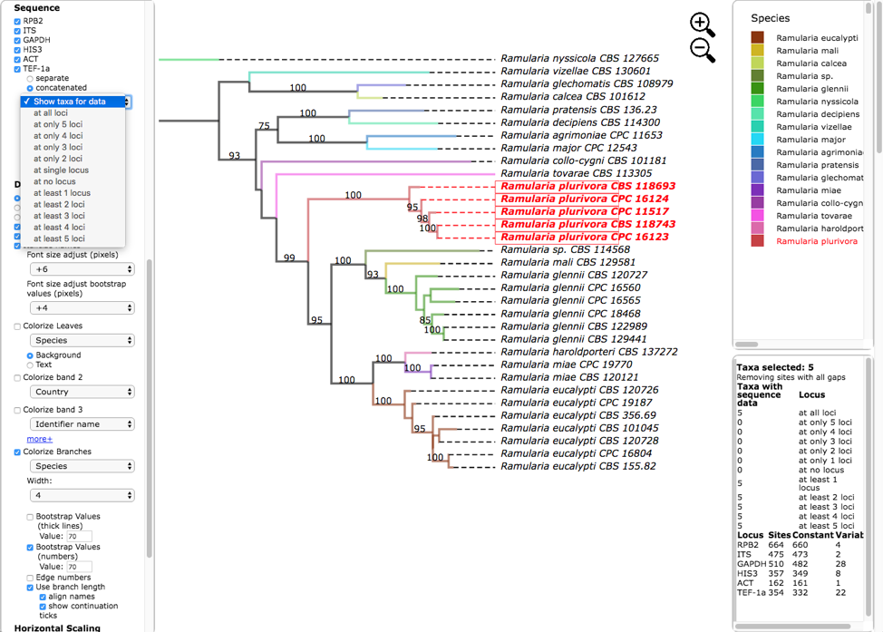