# T-BAS v2.1 Tutorial 1: Viewing Trees, Alignments, and Specimen Metadata

1. In this tutorial we will be using the *Ramularia* reference tree as an example to illustrate the features available when viewing trees in T-BAS. To begin, go to the T-BAS start page (https://tbas.hpc.ncsu.edu/start) and click on the **T-BAS Trees** button (see arrow).
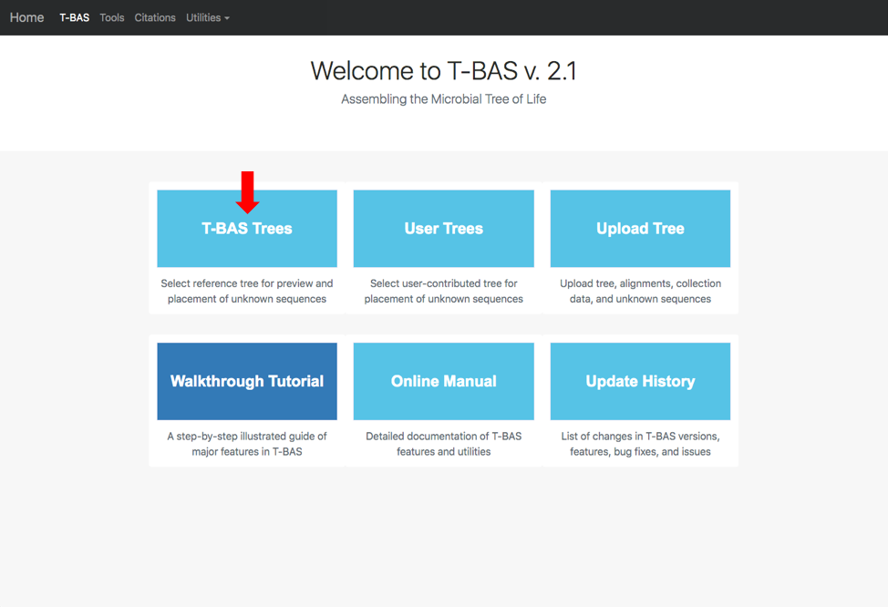

2. Click on the blue bullet to select the *Ramularia* reference tree.  Note only trees with a solid blue bullet in the guide tree contain data.
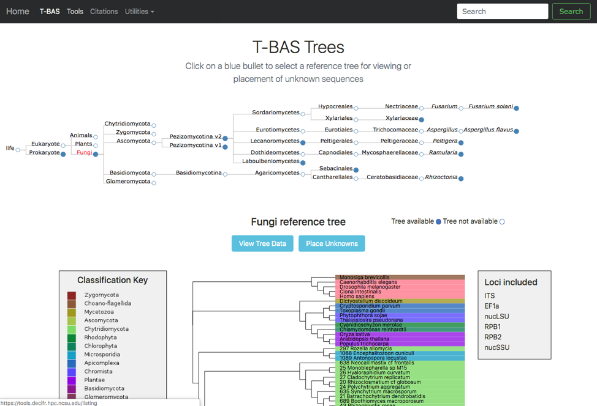

3. The *Ramularia* tree is now highlighted in red.  Below the guide tree are options (blue buttons) for **View Tree Data** (i.e., viewing/downloading of tree, alignments and specimen metadata), and **Place Unknowns** (i.e., phylogenetic placement of unknown sequences).
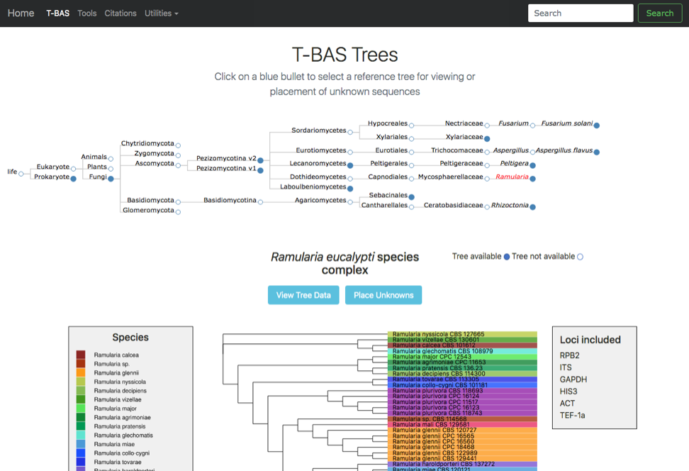

4. Clicking on the **View Tree Data** button will open up a new tab with the *Ramularia* tree. At the top of the left side pane are buttons for **help** (tutorials), **new data** (to place unknown sequences on tree), **update voucher** (to upload new specimen metadata), **color editor** (to assign new colors to attributes in tree), **reset defaults** (to restore default settings; if your settings do not show the defaults shown in the screenshots in this tutorial, hit reset) and **select by list** (to upload a file with a list of taxa to highlight in tree). Entering text in the **Search** box will search for the name across all tree data.  The options under **Highlighted taxa** are available when user selects a leaf or clade in the tree or taxa are selected from an uploaded list.  Note the default settings for **Layout** (radial), **Format** (FASTA - aligned), and **Sequence** (RPB2) in this example.  There are subheadings under **Sequence** if the user wants to view each locus **separate** or multiple loci **concatenated**.
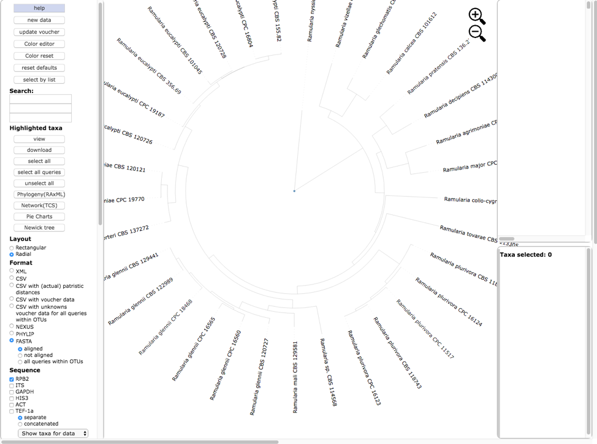

5. Scroll to the bottom of the left side pane to see additional options. Under the Sequence heading and immediately below the separate and concatenated alignment options is a pull down for Show taxa for data (to highlight taxa for different locus combinations) and below the pull down are the alignment default viewing options: remove taxa with no data, remove sites with all gaps, and remove unalignable regions; to view more or less alignment data, check or uncheck one or more of these boxes. The Display section provides options to colorize all leaves, colorize excluding singletons and colorize only singletons. Legends would normally appear in the right-side pane in a single column if Show 1 column legend is checked (e.g. see step 6); unchecking will display legends side by side. Colors can be shown with no transparency.
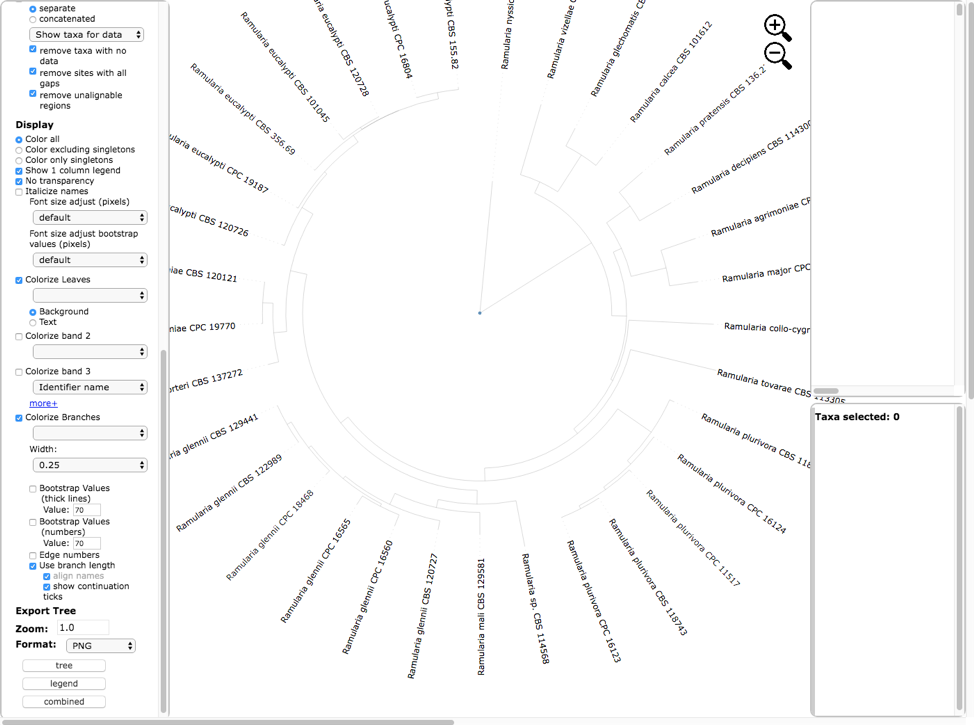
Text options include italicizing names and adjusting font size. The Colorize Leaves option will colorize the outer leaves of the tree according to specimen metadata by selecting from the pull down.  Additional outer rings (i.e. bands) can be added – up to a maximum of 12 by clicking on the more+ option. Additional options will Colorize Branches and the Width of branch lines can be adjusted. Bootstrap values can be displayed on branches or by thickening the lines in the tree for a specified bootstrap threshold value. Edge numbers are used when placing unknowns in T-BAS (see Tutorial 2). Branch lengths are by default drawn to scale. Trees and legend can be Exported separately and combined as PNG, SVG, PDF, and multipage PDF. The Zoom shows the default tree magnification of 1.0, which can be adjusted by clicking the  icons.

6. Below is the tree resized and formatted with the following options selected. Magnification reduced by clicking multiple times on  or panning with mouse until Zoom=0.5220 (or enter the value in the box and press enter), Font size +6, Font size bootstrap +5, Colorize leaves by Species, Colorize band 2 by Country, Colorize Branches by Species, set branch Width to 2, show bootstrap values with thick lines, and show bootstrap values (numbers). The branch lengths are drawn to scale. The legends are displayed in the dashboard window on the right.

7. Below is the tree shown in rectangular layout shown with the following options selected. Magnification increased by clicking multiple times on  until Zoom=0.8316, Font size +6, Font size bootstrap +4, names are Italicized, no colorizing of leaves or bands, Colorize Branches by Species, set Branch Width to 4, and show bootstrap values with numbers. The branch lengths are drawn to scale.  Both the Horizontal and Vertical Scaling were adjusted as shown below.
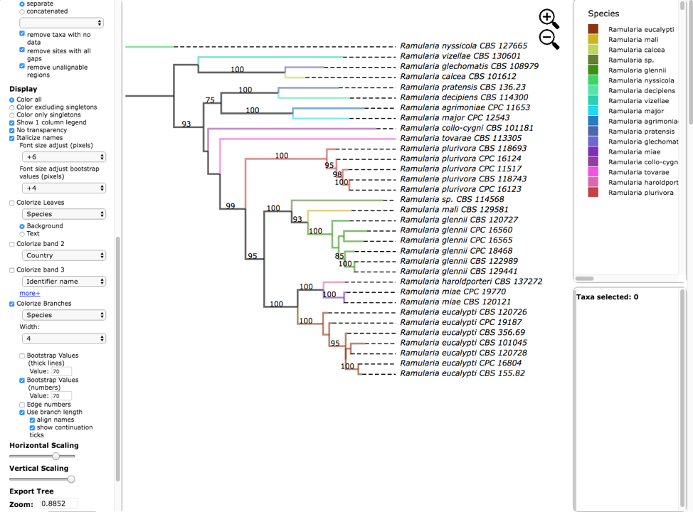

8. Hover over and left click on node (see arrow) to show pop-up menu and under Taxa click on Select.  All the taxa in the selected clade will be highlighted in red. The pop-up also shows available options for Metadata, Labels and Tree. The dashboard window at the top right highlights the selected species and the window below shows the number of taxa selected (5), the number of taxa with missing data for RPB2 (0), number of taxa with data (5).
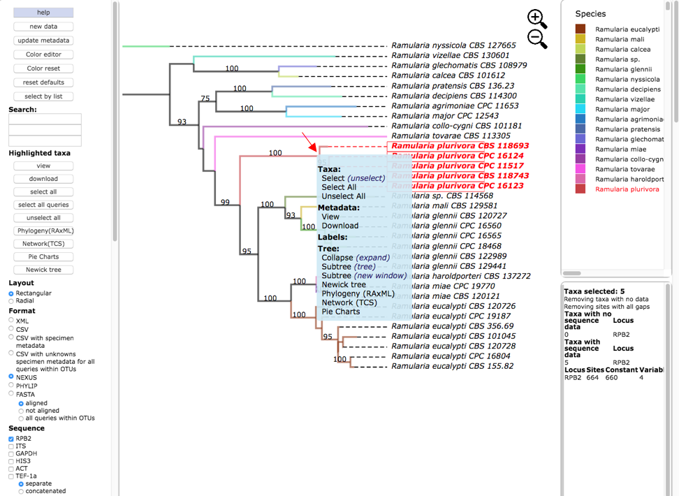

9. Clicking on the view button under Highlighted taxa will show the sequences for RPB2 (NEXUS format) for the highlighted taxa in a new pop-up window. Note the pop-up menu shown in step 8 also has a view option under Metadata. The dashboard window at the bottom right now provides a summary of the total length of the alignment (664), number of constant sites (660) and number of variable sites (4).
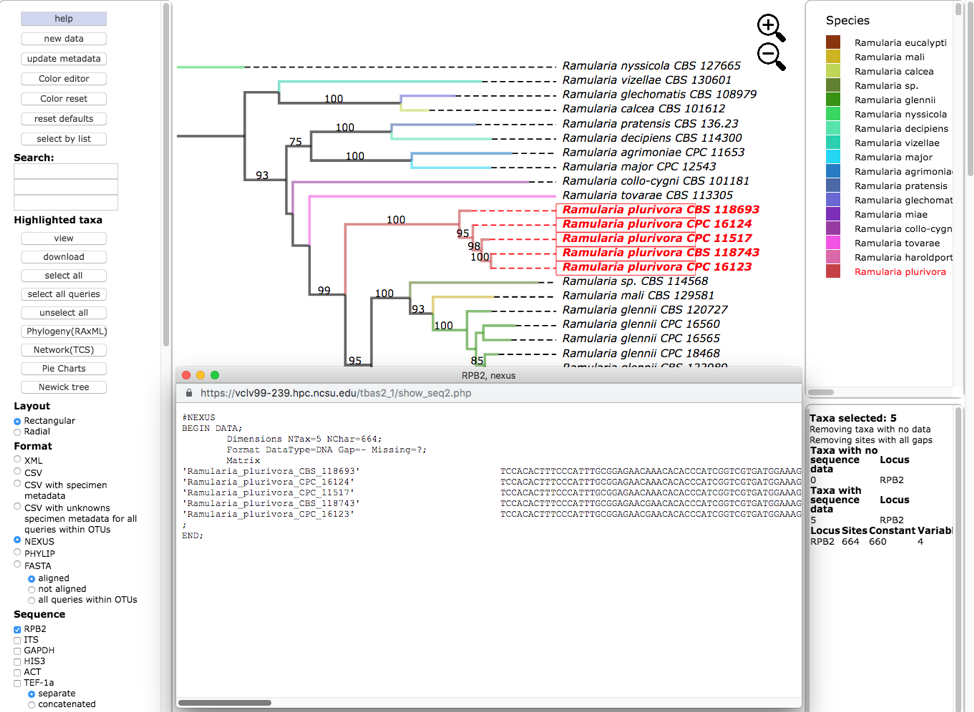

10. Selecting the PHYLIP option under the Format menu and then clicking on the view button under Highlighted taxa will show the sequences for RPB2 (PHYLIP format) for the highlighted taxa in the pop-up window.
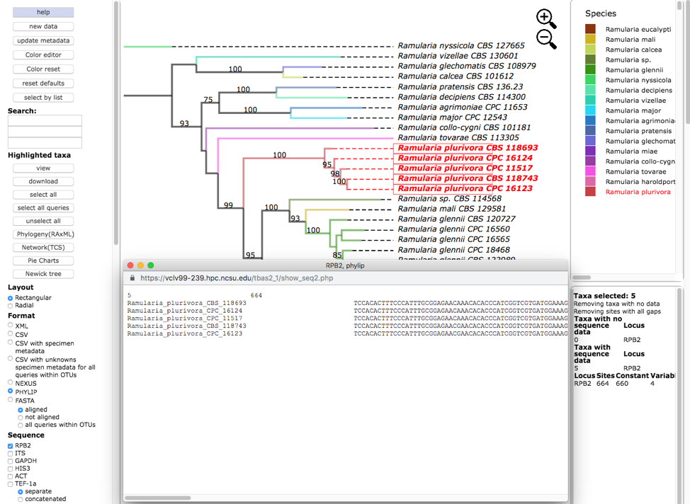

11. Clicking on Newick tree under Highlighted taxa will display the tree for the highlighted taxa in a new tab.  Depending on which option is selected under Format the Newick tree is displayed in NEXUS or PHYLIP format.
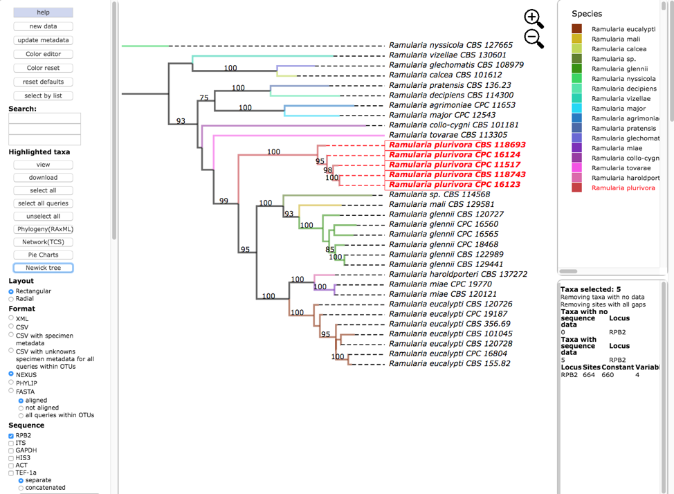

Tree in **NEWICK/NEXUS** format
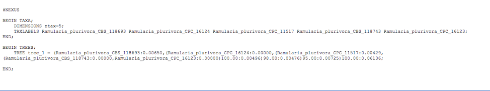

Tree in **NEWICK/PHYLIP** format
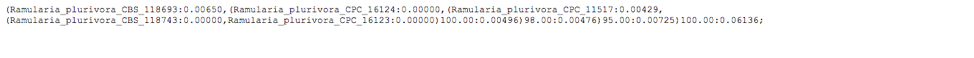

12. Click to select all six loci (RPB2, ITS, GAPDH, HIS3, ACT and TEF-1a), with the concatenated option under Sequence, and NEXUS as the file Format. Then click on view to display the concatenated multi-locus alignment in NEXUS format with character partition block showing the start and end position of each locus in the alignment. The dashboard window on the right provides a summary of the variation for each locus.
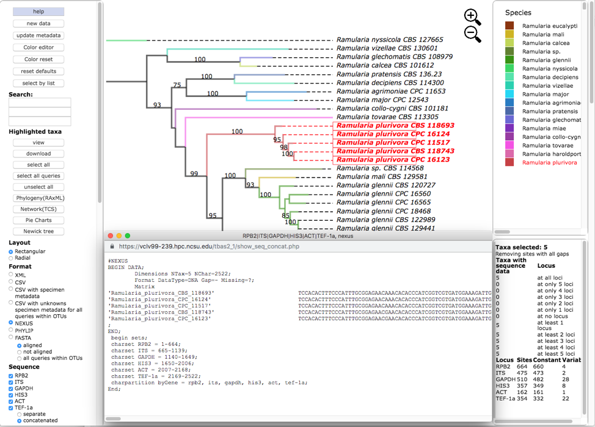

13. Switching the Format to PHYLIP, selecting concatenated under Sequence, and then clicking on view shows the multi-locus concatenated alignment in PHYLIP format.
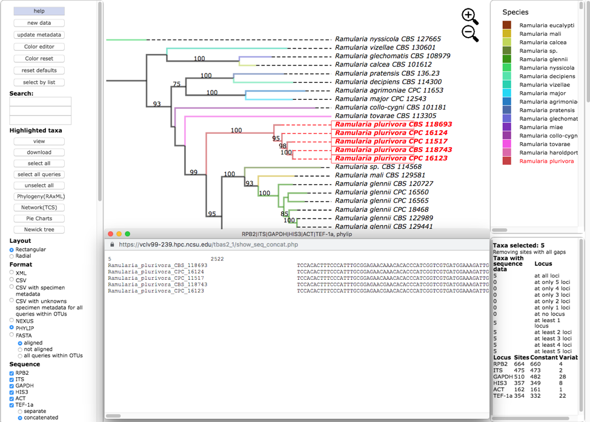

14. Clicking on the Show taxa for data pull-down menu will display options for selecting taxa that contain a specified number of loci.  In this example, all of the five highlighted taxa have data for all six loci.  In other trees, the selected taxa may be missing information for one or more loci. This feature will create alignment files with varying numbers of loci which are useful for assessing topological incongruence using a cumulative supermatrix approach and the Mesquite Hypha package (http://mesquiteproject.org/packages/hypha/manual/index.html).
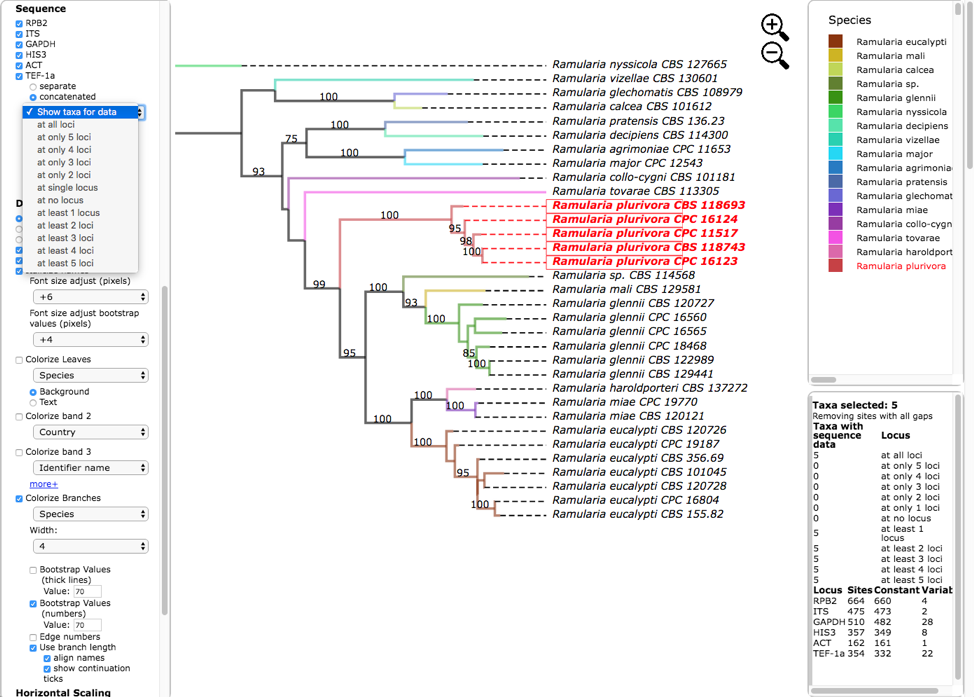