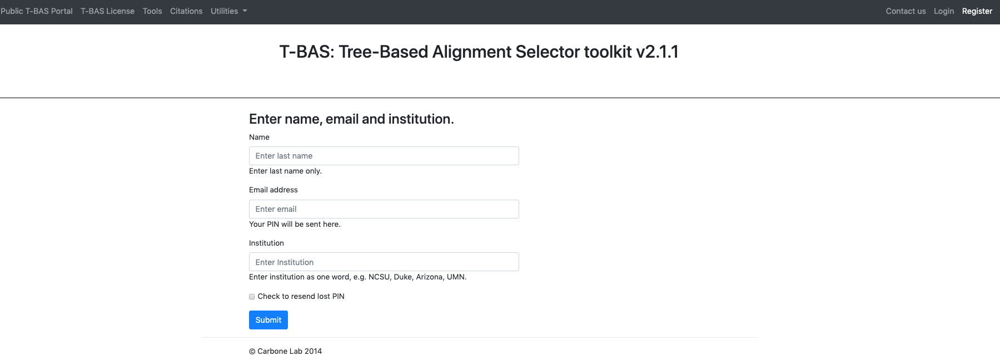

# Tutorial 1: Registration, Login, and Lost PIN

1. Go to the [T-BAS start page](https://tbas.cifr.ncsu.edu//tbas2_3/pages/tbas.php) and click on the **Register** button (see arrow). The blue Register link at the top center of the page can also be used.

2. Fill out the form below with the user last name, email address, and institution name. Click Submit.

An email will be sent with a PIN that will be used to login. Check the SPAM folder if an email is not received.

3. From the [T-BAS start page](https://tbas.cifr.ncsu.edu//tbas2_3/pages/tbas.php), select Login.

4. Use the email address that was used to register and PIN that was assigned in the email. Click the box to acknowledge the note and then click Submit.

## Forgot PIN

5. If a PIN has been misplaced, select Register from the start page.

6. Complete all of the fields as shown in Step 2. Click the box to have the PIN resent as an email. Click Submit.
