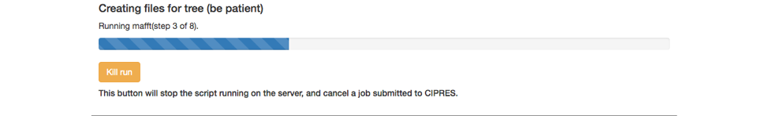
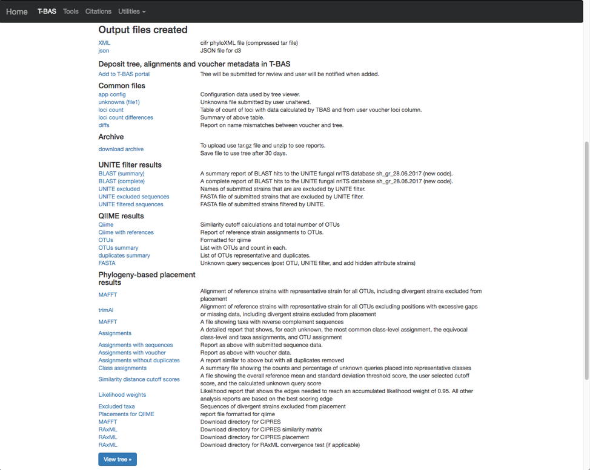

# Tutorial 2: Phylogeny-based placement of unknown sequences, de novo phylogenetic reconstruction of subtrees and haplotype network inference

1. In this tutorial we will be using the *Ramularia* reference tree as an example to illustrate the placement features available in T-BAS. To begin, go to the T-BAS start page (https://tbas.hpc.ncsu.edu/start) and click on the **T-BAS Trees** button (see arrow).

2. Click on the blue bullet to select the *Ramularia* reference tree. Note only trees with a solid blue bullet in the guide tree contain data. References for each tree are provided under the **Citations** menu. We advise users to refer to the original papers for details on the specific primers that were used for amplification and sequencing of the Loci included in T-BAS.

3.  The Ramularia tree is now highlighted in red.  Below the guide tree are options (blue buttons) for View Tree Data (i.e., viewing/downloading of tree, alignments and specimen metadata), and Place Unknowns (i.e., phylogenetic placement of unknown sequences).

4. Click on the Place Unknowns button and login. If you are first time user, you will need to register by clicking on the Registration page link (see arrow).

If you already registered but forgot your PIN you can go to the Registration page and Check to resend lost PIN (see arrow).

5. After registering you will be returned to the login page. Enter your email address, PIN and check the box acknowledging your acceptance of our disclaimer and privacy policy. Then click submit

6. A new tab will open with the options for placing unknown sequences on the Ramularia tree. At the top is the name of the reference set for placement and the loci included in the tree. The section with the header Upload unknown query sequences is used for uploading unaligned unknown sequences in FASTA format. The Add fasta button allows user to select up to a maximum of six loci for placement. Specimen metadata for the unknown samples in CSV format can be uploaded in the section labeled Upload unknowns metadata (optional). If a column with the class header is included in the CSV metadata file, T-BAS will calculate class placement F-scores where higher F-scores indicate better class placement accuracy. The Retain all metadata for OTU members only applies if you are clustering sequences into OTUs (next section in form). Typically, when clustering is done only one representative sequence is kept for each OTU but if this option is selected other members within the OTU that have different attributes will be displayed in the tree.

7. In this tutorial we will use the example files that are provided.  Note when you are examining your own data you will need to upload your FASTA files. This is important so that the locus name is included in the filename for associating with reference loci (step 10). Under Upload unknown query sequences click on the Unknowns ITS file1 (see arrow) to have it displayed as shown below.  Similarly, under the Upload unknowns metadata (optional) click on the Unknowns metadata (see arrow) to use that file.

8. The section labeled BLAST unknowns options applies only if one of the uploaded unknowns sequence files is for the nuclear ribosomal internal transcribed spacer (ITS) region. If yes, then two options are available: (1) generate a report based on a BLASTn search of the UNITE database for the uploaded ITS sequences or (2) remove unknown sequences that are not a significant match to sequences classified at the next higher taxonomic level in UNITE with E-value < 1e-20.  Since in this example we are examining ITS sequences we select the third bullet to filter unknowns. The section labeled Cluster and filter unknowns optionsa allows the user to (1) specify the similarity value to cluster unknown query sequences, and (2) specify the genetic distance cutoff (in standard deviations)b to use for excluding highly divergent outlier sequences before running placements. In this example we will use the default settings.
  * *The auto setting will automatically select the highest similarity level that will not exceed 4000 OTUs which is optimal for user interaction with tree. Switching to any other setting will include all OTUs in the tree even if exceeds 4000*.
  * *To identify highly divergent sequences we first generate a similarity matrix for all pairs of strains using RAxML. For each strain, we then determine the minimum distance among all pairwise comparisons. The minimum distance values for all the reference strains are used to calculate the overall mean and standard deviation threshold. If a query sequence minimum distance value falls above the threshold selected by the user, it is excluded from the analysis*.

9.  The next section labeled RAxML options provides three options for phylogeny-based placement of unknown query sequences: (1) Evolutionary Placement Algorithm (EPA) with likelihood weights, (2) Backbone constraint tree with bootstraps, and (3) De novo single or multi-locus phylogenetic analysis. Of the three methods, EPA is the fastest and is the default method that will be used in this example. Additional parameters that can adjusted are the rate heterogeneity model and the DNA substitution model. The defaults shown are recommended for normal runs. If RAxML takes more than a few days to complete you could try using GTRCAT instead of GTRGAMMA. Options are also available to use outgroup for rooting trees with placements and to specify the layout of the tree using ladderize tree.  To start the placement run, click on the blue Submit button (see arrow). Pop-ups will need to be allowed in order for the next page to open. Once pop-ups are enabled, hit the submit button again.

10.  Clicking on the submit button will open a new tab summarizing the files and parameters that the user selected for the run. Note the run number at the top – in this example it is SY7214VF. When running this tutorial, you will have a different run number.  All placement results including sequence and specimen metadata for a run will be saved in a PhyloXML file that is tagged with the unique run number.  Select the reference locus corresponding to the locus that was uploaded by clicking on the pull-down (see arrow) and selecting the ITS. After the ITS is selected click on submit.

As a side note: when uploading multiple files, you will need to match each uploaded file with the reference locus as shown below.  We advise uploading files with the locus in the filename.

11. The run will start, and a progress bar shows the current step in the analysis pipeline.  A Kill run button is provided if you decide to terminate the run. Below are some screenshots showing the run progression.

12. The run should complete in under 10 min and the results will be displayed in the browser window.

13. T-BAS will also send you an email with links to the output files and the runtime options that were selected for the run. Note this run will be deleted after 30 days so if you would like to keep the results you can download the files separately or download archive of all the files (see arrow). The XML is a phyloXML file that includes the tree, alignments and metadata for the entire run. The BLAST report and the Assignments file (see arrows) summarize results from BLAST searches of UNITE and EPA phylogeny-based placement on Ramularia reference tree, respectively. The Qiime file reports that clustering was done at the 1.0 level (i.e. duplicates removed).

14.  Click on the Assignments file to download and open in Excel. This file shows that four unknown sequences were excluded using the UNITE filter and that all the unknowns belong to a single OTU0 and are most closely related to Ramularia collo-cygni. This placement is strongly supported with an accumulated likelihood weight of 0.999991 out of a total of 1.0. When using EPA placement, likelihood scores that are less than 0.95 indicate weaker placements that may be unreliable.

Aside note: If the UNITE filter is skipped and you run this placement again, the genetic distance cutoff will also exclude the same four sequences. This shows the utility of the genetic distance cutoff when placing sequences from other loci since the UNITE database is only for ITS.

15.  Click on the BLAST (complete) file to download and open in Excel. This file shows that the four excluded taxa (2073, 2072, 2070, 2076) belong to different families and orders.

16. The tree with the placements can be viewed by clicking on the view tree link in the email or the View tree button in the browser results page

17.  Below is the tree resized and formatted with the following options selected. Magnification reduced by clicking multiple times on  or panning with mouse until Zoom=0.5220 (or enter the value in the box and press enter), Font size +8, Colorize leaves by Species, and set branch Width to 2. The branch lengths are drawn to scale. The legend is displayed in the dashboard window on the right. Note only a single representative of OTU0 (411) is displayed in the tree. Click on the leaf (see arrow) to display the pop-up menu and select Likelihood weight under Labels.

18. This will highlight 411 and its nearest sibling Ramularia collo-cygni where the accumulated likelihood weight has reached a value of at least 0.95 out of a total of 1.0. This is a graphical method of visualizing the reliability of placements – the Assignments file shows the calculated likelihood weights. In the dashboard window on the left, click on PHYLIP under Format and ITS under Sequence (unclick the RBP2) and then click on view (see arrow). The alignment of the two selected taxa will appear in a new pop-up window. Then click on the Phylogeny (RAxML) button (see arrow).

19. A new tab will open with options for performing de novo phylogenetic reconstruction for the selected taxa. Check the boxes for Realign sequences in clade with MAFFT, Include unknowns duplicates in alignment and ITS.  Copy and paste the reference taxa Ramularia_collo-cygni_CBS_101181 from the alignment file in the previous step into the Outgroup names box and hit submit.

20. A progress bar will appear to allow the user to monitor the run which should finish in under 5 min. T-BAS will also send you an email when the run is complete.

Then click on view tree (see arrow).

21.  Here is the tree displayed using Rectangular under Layout. Reset the Defaults under Help (see arrow). The order of isolates may be different from what is shown in this view.

Select all the leaves in tree by clicking on select all (see arrow). View the alignments by selecting PHYLIP under Format and then clicking on view (see arrow). The alignment shows additional variation (see arrows) within OTU0 that was ignored in the original placement of the clustered sequences.

22. Return to the original placement phylogeny (in one of the tabs) and click on the Network (TCS) button (see arrow).

23.  A new tab will open showing the available options for network inference using statistical parsimony. Gaps can be treated as a fifth character state or as missing data and parsimony connection limits of 90-99%. Check the options to Realign sequences in clade with MAFFT and ITS. If placements were performed for multiple loci the user will be able to examine networks for different locus combinations.  Hit submit to start the run.

The progress bar shows that MAFFT is running.

24. At the end of the run a results page is generated. Click on the viewer link (see arrow) to view the network.

You will also receive an email with the results from the run.

25.  The network shows that OTU0 comprises three haplotypes with one that was sampled on all five collection dates and on all three hosts. The dashboard window on the left in the viewer displays the selected attribute legend (i.e. date collected or host ID). You can switch attributes using the pull-down (see arrow) and the colors in the network will automatically update.

Select names under the Click on node to show and then click on the intermediate sized node on the left (see arrow). This will display the specimen names in that node in a pop-up window and a summary of the Attribute Count for the selected node on the left panel at the bottom.

Select alignments and select Host ID as shown for the image on the right. Click on the intermediate sized node (see arrow) on the right to display the alignments.

