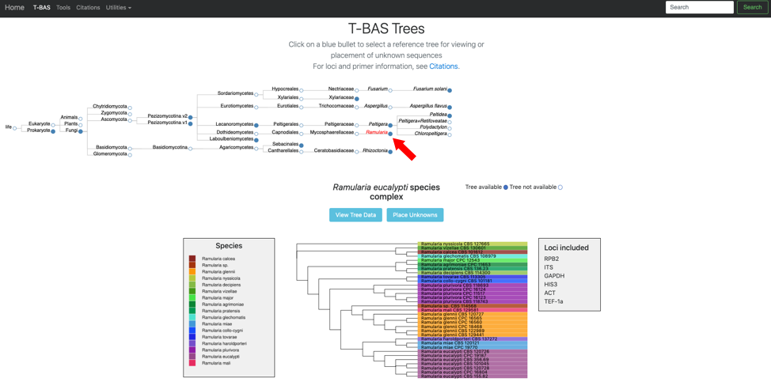
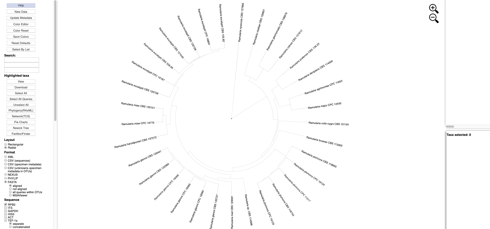
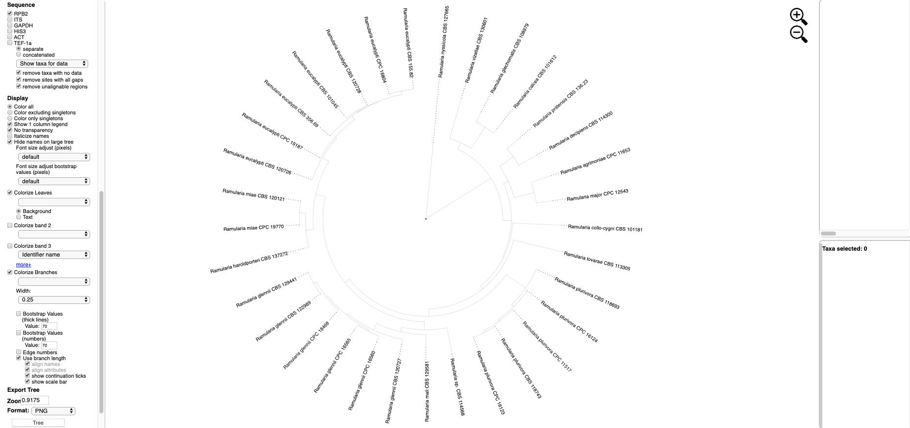
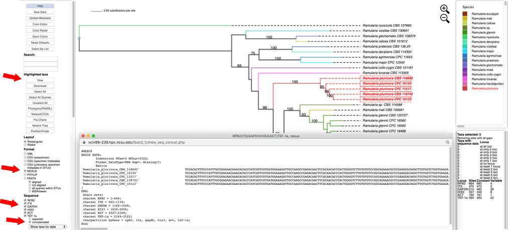
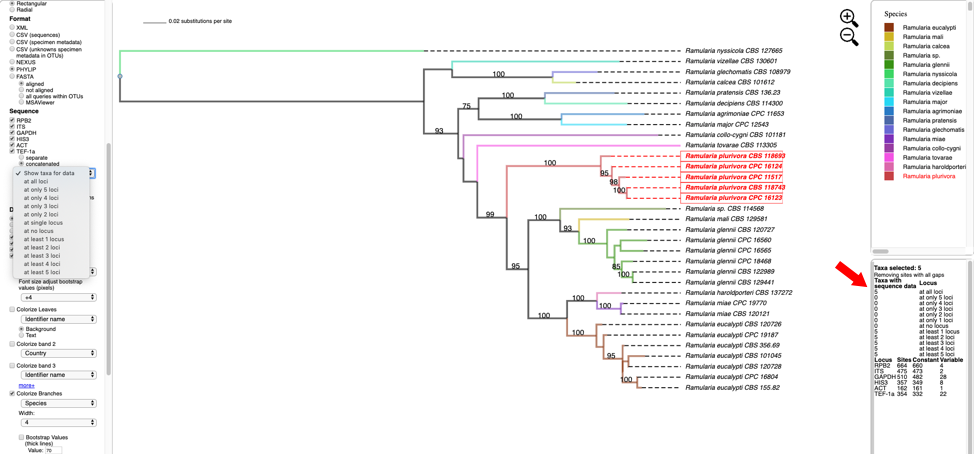

# Tutorial 2: Viewing T-BAS trees, alignments, and specimen metadata

In this tutorial we will be using the *Ramularia* reference tree as an example to illustrate the features available when viewing trees in T-BAS.

Pop-up windows will need to be enabled when using TBAS.

1. Go to the [T-BAS start page](https://vclv99-239.hpc.ncsu.edu/tbas2_1/pages/tbas.php) and click on the **T-BAS Trees** button (see arrow).

2. Click on the blue bullet to select the *Ramularia* reference tree.  Note only trees with a solid blue bullet in the guide tree contain data.

3. The *Ramularia* tree is now highlighted in red.  Below the guide tree are options (blue buttons) for **View Tree Data** (i.e., viewing/downloading of tree, alignments and specimen metadata), and **Place Unknowns** (i.e., phylogenetic placement of unknown sequences).

4. Clicking on the **View Tree Data** button on previous page will open up a new tab with the Ramularia tree. At the top of the left side pane are buttons for **Help** (tutorials), **New Data** (to place unknown sequences on tree), **Update Metadata** (to upload new specimen metadata), **Color Editor** (to assign new colors to attributes in tree), **Color Reset** (to restore colors to default settings), **Reset Defaults** (to restore default settings; if your settings do not show the defaults shown in the screenshots in this tutorial, hit reset defaults) and **Select By List** (to upload a file with a list of taxa to highlight in tree). Entering text in the **Search** box will search for the name across all tree data and display it in red.  The options under **Highlighted taxa** are available when user selects a leaf or clade in the tree or taxa are selected from an uploaded list.  Note the default settings are **Layout** (radial), **Format** (FASTA - aligned), and **Sequence** (RPB2) in this example.  There are subheadings under **Sequence** if the user wants to view each locus **separate** or multiple loci **concatenated**.

5. Scroll to the bottom of the left side pane to see additional options. Under the **Sequence** heading and immediately below the **separate** and **concatenated** alignment options is a pull down for **Show taxa for data** (to highlight taxa for different locus combinations) and below the pull down are the alignment default viewing options: **remove taxa with no data, remove sites with all gaps**, and **remove unalignable regions**; to view more or less alignment data, check or uncheck one or more of these boxes. The **Display** section provides options to **Color all** leaves, **Color excluding singletons** and **Color only singletons**. Legends would normally appear in the right-side pane in a single column if **Show 1 column legend** is checked (e.g. see step 6); unchecking will display legends side by side. Colors can be shown with **No transparency**.

Text options include **Italicize names** and **adjusting font size**. The **Colorize Leaves** option will colorize the outer leaves of the tree according to specimen metadata by selecting from the pull down.  Additional outer rings (i.e. bands) can be added – up to a maximum of 12 by clicking on the **more+** option. Colors can be applied to the **Background** or **Text**. Additional options will **Colorize Branches** and the **Width** of branch lines can be adjusted. **Bootstrap Values** can be displayed on branches or by thickening the lines in the tree for a specified bootstrap threshold value. **Edge numbers** are used when placing unknowns in T-BAS (see Tutorial 2). **Branch lengths** are by default drawn to scale. Trees and legend can be **Exported** separately and combined as PNG, SVG, PDF, and multipage PDF. The **Zoom** shows the tree magnification, which can be adjusted by clicking the  icons or typing a value into the box. The default is 1.0.

6. Below is the tree resized and formatted with the following options selected:  
   **Zoom** 0.6070  
   **Font size** +6  
   **Font size bootstrap** +5  
   **Colorize Leaves** by Species  
   **Colorize band 2** by Country  
   **Colorize Branches** by Species  
   Branch **Width** 2  
   **Bootstrap Values with thick lines**  
   **Show bootstrap Values (numbers)**.  
   **Branch lengths** are drawn to scale.  

   The legends are displayed in the dashboard window on the right.
   

7. Below is the tree shown in **Rectangular** layout shown with the following options selected:  
   **Zoom** 1.0  
   **Font size** +3  
   **Font size bootstrap** +4  
   Names are **Italicized**  
   No colorizing of leaves or bands  
   **Colorize Branches** by Species  
   Branch **Width** to 4  
   **Show bootstrap Values (numbers)**.  
   **Branch lengths** are drawn to scale.  
   **Horizontal** and **Vertical Scaling** were adjusted as shown below.  
   

8. Hover over and left click on node (see arrow) to show pop-up menu and under **Taxa** click on **Select**.  All the taxa in the selected clade will show in red. The pop-up menu also shows available options for **Metadata, Labels**, and **Tree**. The dashboard window at the top right highlights the selected species and the window below shows the number of taxa selected (5), the number of taxa with missing data for RPB2 (0), number of taxa with data (5).

9. Change the **Format** to **NEXUS** and reset defaults. Clicking on the **View** button under **Highlighted taxa** will show the sequences for RPB2 (**NEXUS** format) for the highlighted taxa in a new pop-up window. Note the pop-up menu shown in step 8 also has a **View** option under **Metadata** that could be used instead. The dashboard window at the bottom right now provides a summary of the total length of the alignment (664), number of constant sites (660) and number of variable sites (4).

10. Selecting the **PHYLIP** option under the **Format** menu and then clicking on the **View** button under **Highlighted taxa** will show the sequences for RPB2 (**PHYLIP** format) for the highlighted taxa in the pop-up window.

11. Clicking on **Newick Tree** under **Highlighted taxa** will display the tree for the highlighted taxa in a new tab.  Depending on which option is selected under **Format** the Newick tree is displayed in **NEXUS** or **PHYLIP** format.

Tree in **NEWICK/NEXUS** format

Tree in **NEWICK/PHYLIP** format

12. Click to select all six loci (RPB2, ITS, GAPDH, HIS3, ACT and TEF-1a), with the **concatenated** option under **Sequence**, and **NEXUS** as the file **Format**. Then click on **View** to display the concatenated multi-locus alignment in NEXUS format with character partition block showing the start and end position of each locus in the alignment.

    This information is useful when using other tools, for example [PartitionFinder](http://www.robertlanfear.com/partitionfinder/) to identify the optimal data partitions evolving under the same evolutionary model. The dashboard window on the right provides a summary of the variation for each locus.
    

13. Switching the **Format** to **PHYLIP**, selecting **concatenated** under **Sequence**, and then clicking on **View** shows the multi-locus concatenated alignment in PHYLIP format.

14. Clicking on the **Show taxa for data** pull-down menu will display options for selecting taxa that contain a specified number of loci.

    In this example, all of the five highlighted taxa have data for all six loci. In other trees, the selected taxa may be missing information for one or more loci. This feature will create alignment files with varying numbers of loci which are useful for assessing topological incongruence using a cumulative supermatrix approach and the [Mesquite Hypha](http://mesquiteproject.org/packages/hypha/manual/index.html) package.
    

