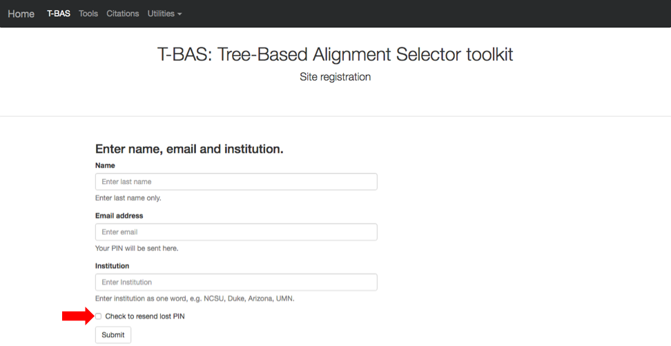
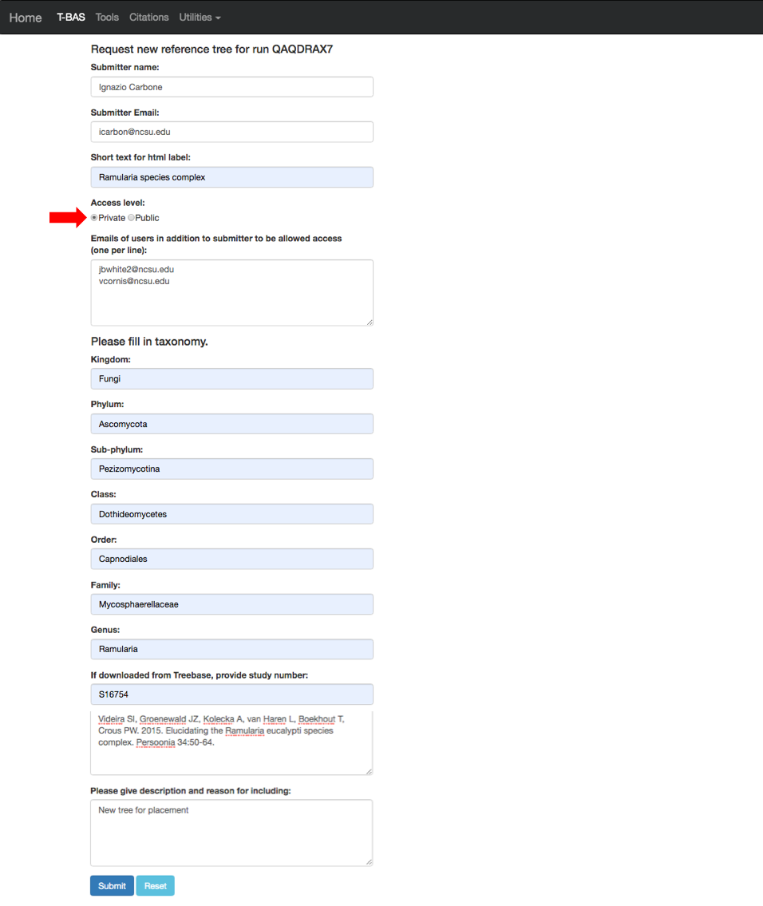

# Tutorial 3: Uploading and creating a custom T-BAS reference tree with alignments and specimen metadata, and option to place unknown sequences and metadata

1. In this tutorial we will be uploading a custom reference tree and all of the files that are needed to perform a placement of unknown sequences on that tree. We will use the *Ramularia* reference tree and files that are available in [TreeBase](https://www.treebase.org/treebase-web/search/studySearch.html). For your convenience we made these files available as links in the tutorial. They can be downloaded by searching for the S16754 study ID in [TreeBase](https://www.treebase.org/treebase-web/search/studySearch.html) and retrieving the original [tree](http://purl.org/phylo/treebase/phylows/tree/TB2:Tr79968?format=nexus) and [alignment](https://www.treebase.org/treebase-web/search/downloadANexusFile.html?id=16754&treeid=79968) files. The specimen metadata was extracted from Table 1 in [Videira et al. 2015](https://www.ncbi.nlm.nih.gov/pmc/articles/PMC4510271/). To begin, go to the T-BAS start page (https://tbas.hpc.ncsu.edu/start) and click on the **Upload Tree** button (see arrow).

2. You will be required to login. If you are first time user, you will need to register by clicking on the **Registration page** link (see arrow).

If you already registered but forgot your PIN you can go to the Registration page and **Check to resend lost PIN** (see arrow).

3. After registering you will be returned to the login page. Enter your email address, PIN and check the box acknowledging your acceptance of our disclaimer and privacy policy. Then click **Submit**.

4. After login you will see two options for uploading trees: **Newick tree** or **cifr phyloXML**.  The **Newick** format is for the tree only and selecting this option will expand the window to allow you to upload the sequence alignment and specimen metadata for the reference tree. The **cifr phyloXML** is a new data standard that extends phyloXML to include both sequence alignments and specimen metadata.  The cifr phyloXML makes it convenient to place on trees from previous T-BAS runs because only one file needs to be uploaded. To begin click on **Newick tree** (see arrow).

5. This will expand the display to show three upload sections: **Upload reference tree, Upload reference sequence alignment** and **Upload reference metadata**.  Click on the example file links (see arrows) for each section to load the files.

6. The example files will now be visible and can be edited.  We will be making some minor edits to the Nexus sequence alignment file. To see more of the alignment file, click and drag down the corner box (see arrow).

7. The expanded window will look as shown below.  Search for “locus” in your browser.

8. The search will highlight the loci that are defined in the character partition block and preceded by “charset” (see arrow). If we make no changes the loci will be labeled as locus1, locus2, locus3, locus4, locus5 and locus6 in T-BAS. These names make it difficult to track these loci when performing placements and retrieving data. In this example, the actual name of the locus is provided at the end of the charset line. For example, for locus1 the name is RPB2. Note all locus designations in the alignment file (highlighted in yellow and orange) will need to be relabeled – see next step.

9. Here are the relabeled loci. T-BAS can now correctly track the loci and the user will know which target locus to select when performing a placement (described below).

10. Scroll to the next section where you will be able to view the reference files or perform a phylogeny-based placement using those files.  Whenever uploading a new dataset in T-BAS first view the files to make sure they are imported correctly.  Leave the default as shown below (see arrow) and hit submit.

11. After the run is done the results will be summarized in the browser and you will receive an email. You will be able to download a **cifr phyloXML** file with all the reference files to use in future placements. If you would like to make the reference set available to others there is an option to **Add to T-BAS portal**. We will return to these options but first view the tree to make sure all looks correct.

12. Below is the tree resized and formatted with the following options selected:     
    **Zoom** 0.5220   
    **Font size** +6  
    **Colorize leaves** by Species  
    Branch **Width** 2  
    **Branch lengths** are drawn to scale  
    
    The legend is displayed in the dashboard window on the right. The displayed colors may be different than what is shown in other runs.

13. Download the cifr phyloXML file.

14. Select the **cifr phyloXML** option (see arrow), upload the **cifr phyloXML** file downloaded from the previous step, and click submit.

15. After the run is complete, click on **View tree**. As you can see below the cifr phyloXML file contains the tree, alignments (six labeled loci) and specimen metadata. If you want to use this reference set in the future, you will just need to upload this cifr phyloXML file. This tree is resized and formatted with the following options selected:   
    **Zoom**=0.5220  
    **Font size** +6  
    **Colorize leaves** by Species  
    Branch **Width** 2  
    **Branch lengths** are drawn to scale  
    
    The legend is displayed in the dashboard window on the right.

16. To add this reference set to the T-BAS portal select the **Add to T-BAS portal** link.

17. The following form will appear.

18. Here is an example of the form filled out. Note this tree is **private** and shared with only two other people (email list); if you want to make it **public** change the selection in the **Access level** (see arrow). Click submit at the bottom of the form.

19. Once your tree has been reviewed by T-BAS admin it will be made available for viewing and placement by clicking on **User Trees** on the T-BAS start page. You will receive an email notification of the status of your submitted tree and when it is available for use in T-BAS.

List of available trees. For example, click on the **_Ramularia_ species complex** tree (see arrow).

20. After clicking on the bullet for **_Ramularia_ species complex**, the buttons to **View Metadata** or **Place Unknowns** will be visible.

21. Return to the upload tree form (from the TBAS page) and select **cifr phyloXML** and upload file.  Then click on **yes** (see arrow) to perform placement.

22. Selecting **yes** will provide options for **uploading unknown query sequences** and **Upload unknowns metadata (optional)**. Click on the links (see arrows) to select the example files.

The examples will appear in the windows as shown below.

23. Scrolling down on the page will show **BLAST unknowns options, Cluster and filter unknowns options** and **RAxML options**.  These features function exactly as described in tutorial 2.  In this example we will run the placement with the default values and enter the strain **Ramularia_nyssicola_CBS_127665** as the outgroup.  Hit the **Submit** button.

24. A new tab will open showing the selected options for the placement (ensure pop-ups are enabled. If not, enable them and then try again). From the pull-down window select **ITS** and then hit **submit**.

25. The run will terminate quickly with the following error **"Newick tree submitted is not bifurcating. Must select constraint tree with multifurcating"**.  This sometimes happens with trees that you download from TreeBase because they are 70% majority-rule bootstrap consensus trees and have multifurcations. **EPA with likelihood weights** can only use bifurcating trees so if you have a **multifurcating tree with polytomies** use the backbone constraint placement method described in next step.

26. Return to the RAxML options and select **Backbone constraint tree with bootstraps** and **Multifurcating reference tree with polytomies** (see arrows).  Then hit **Submit**.

27. Select the ITS partition from the pull-down and click **submit**.

28. The run takes about 10 min to complete.

29. Here is the summary of the output files after the run is done. If you download the **cifr phyloXML** file (see arrow) it is possible to continue placing more unknowns by using this phyloXML as a starting tree in step 21. Click on **View tree**.

30. Here is the tree with the following options selected:  
    **Zoom** 0.6260  
    **Font size** +6  
    **Font size adjust bootstrap** +6  
    **Colorize leaves** by Species  
    Branch **Width** 2  
    **Branch lengths** are drawn to scale  
    **Bootstrap values** box is checked  
    
    The legend is displayed in the dashboard window on the right.  
    
    All of the sequences belong to a single OTU and a single representative sequence (411) from that OTU is displayed in the tree.

