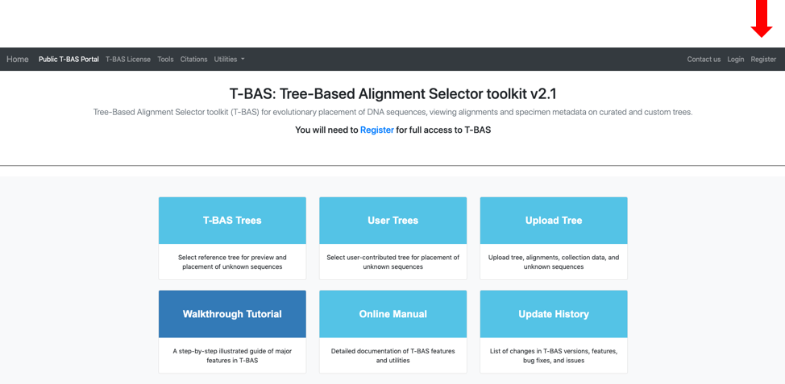
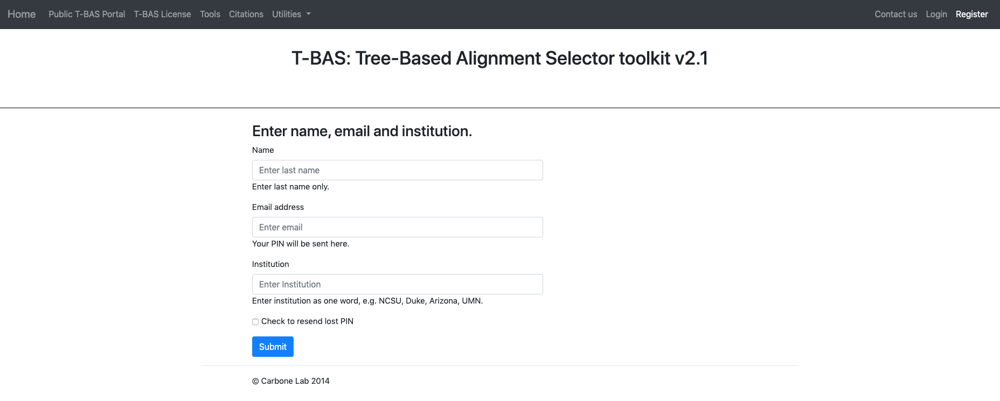
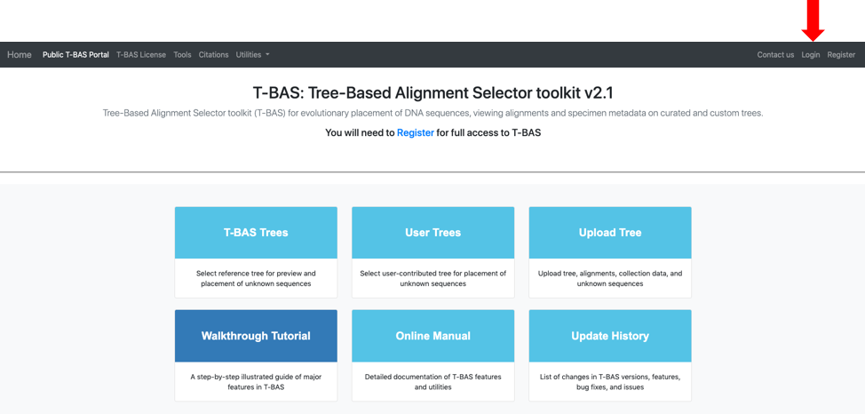
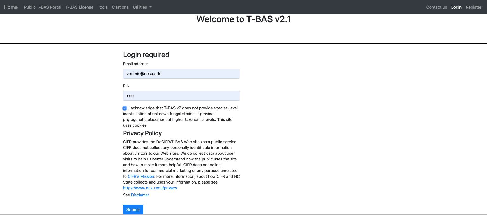
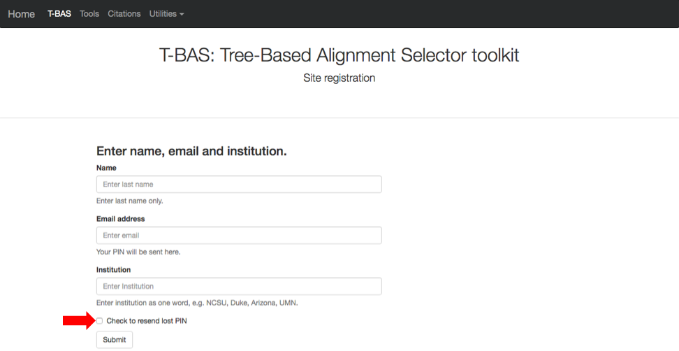

# Tutorial 3A: Uploading and creating a custom T-BAS reference tree with alignments and specimen metadata

1. In this tutorial we will be uploading a custom reference tree and all of the files that are needed to perform a placement of unknown sequences on that tree. We will use the Ramularia reference tree and files that are available in TreeBase. For your convenience we made these files available as links in the tutorial. They can be downloaded by searching for the S16754 study ID in TreeBase and retrieving the original tree and alignment files. The specimen metadata was extracted from Table 1 in Videira et al. 2015.  

    To begin, go to the T-BAS start page (https://tbas.hpc.ncsu.edu/) and click on Register to register for an account. If an account has already been established, go to step 4.

2. Fill out the fields shown and click Submit.

3. On the homepage, click Login at the top right.

Fill out the fields and click Submit.

If you already registered but forgot your PIN you can go to the Registration page and Check to resend lost PIN (see arrow).
