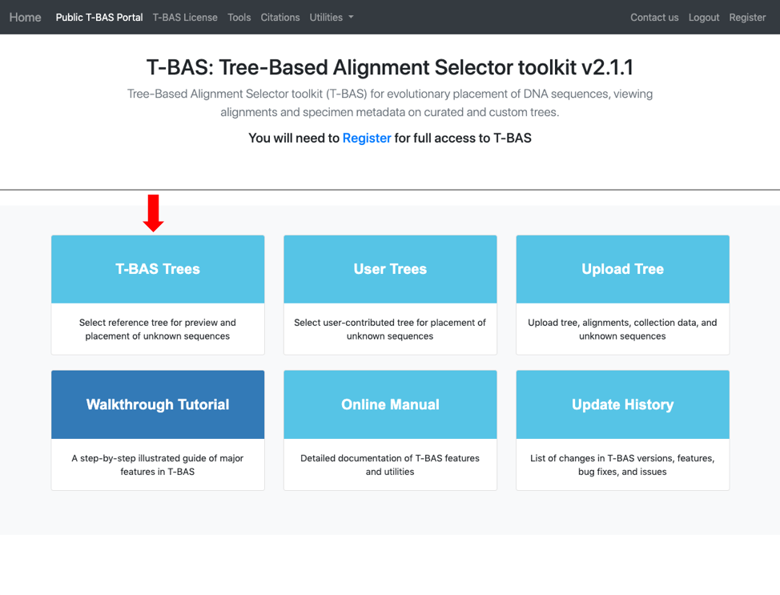

# Tutorial 3: Phylogeny-based placement of unknown sequences, de novo phylogenetic reconstruction of subtrees and haplotype network inference

1. In this tutorial we will be using the Ramularia reference tree as an example to illustrate the placement features available in T-BAS. To begin, go to the T-BAS start page and click on the T-BAS Trees button (see arrow).
