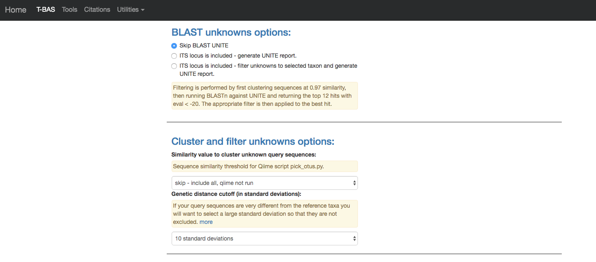
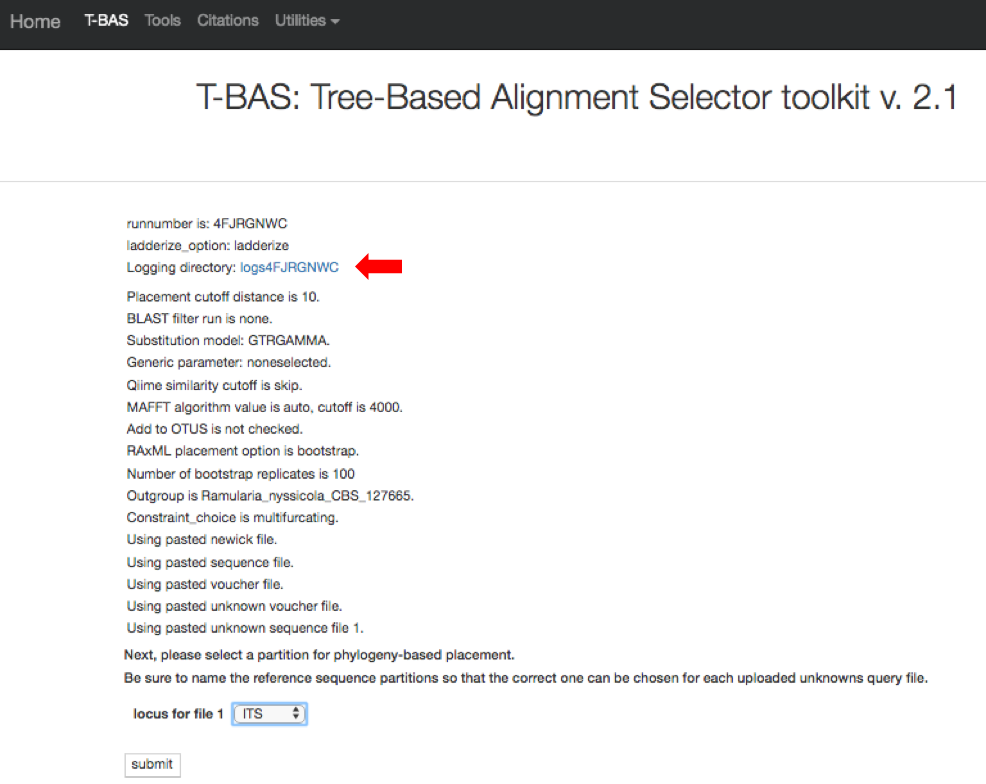
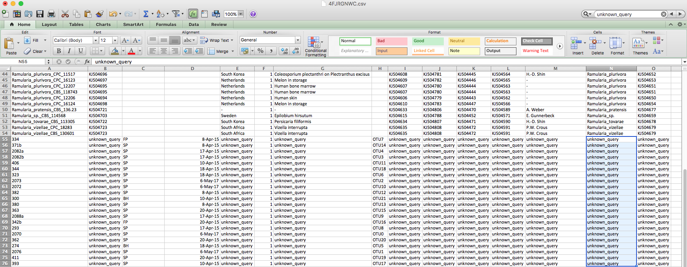
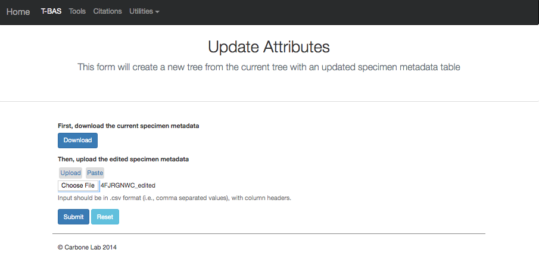
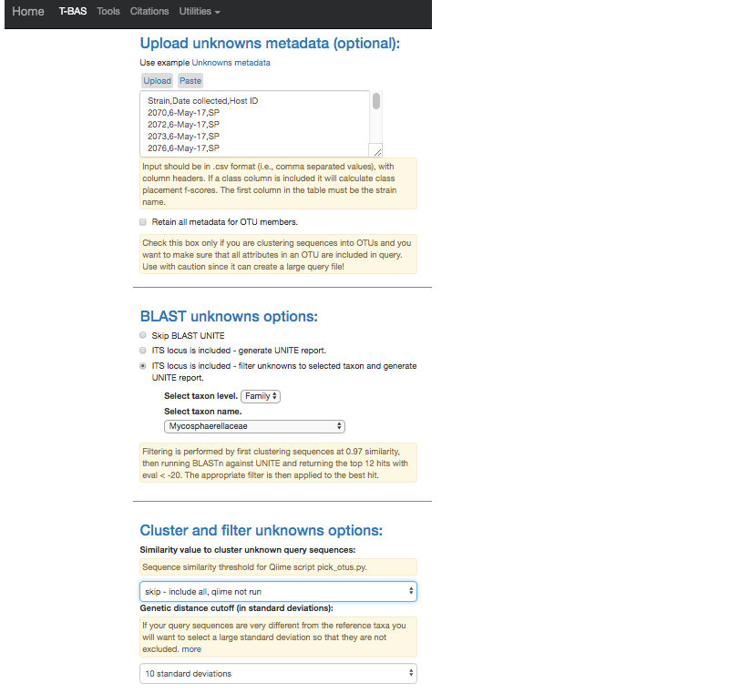
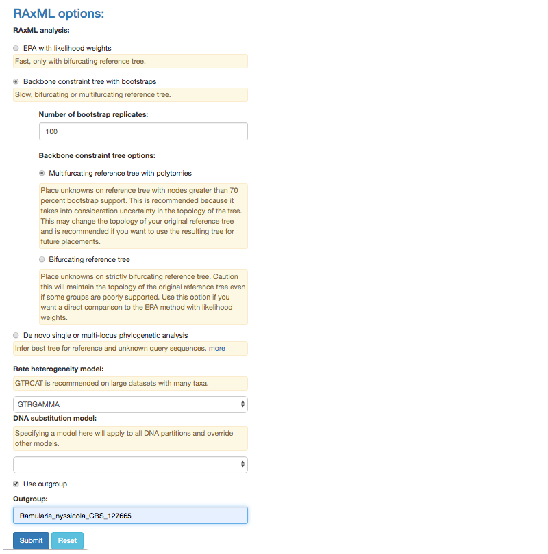
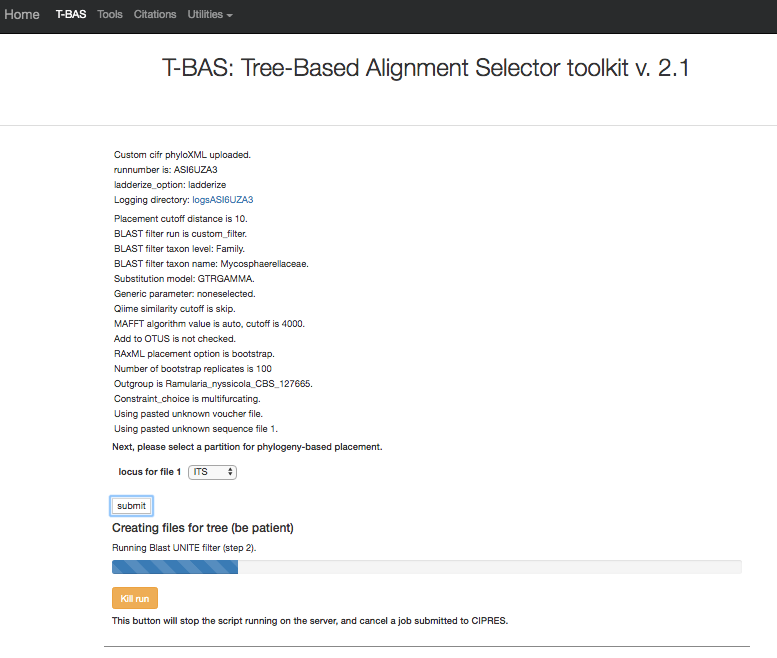
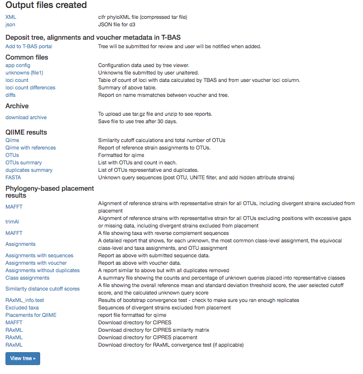

# T-BAS v2.1 Tutorial 4: Using cifr phyloXML to cumulatively update trees

1. 1) In this tutorial we will show how you can perform consecutive placements on the same tree. This is useful to build on a previous placement run with additional sequence data. To start, go to the T-BAS start page (https://tbas.hpc.ncsu.edu/start) and click on the Upload Tree button (see arrow).

2. You will be required to login. If you are first time user, you will need to register by clicking on the **Registration page** link (see arrow).

If you already registered but forgot your PIN you can go to the Registration page and **Check to resend lost PIN** (see arrow).

3. After registering you will be returned to the login page. Enter your email address, PIN and check the box acknowledging your acceptance of our disclaimer and privacy policy. Then click **Submit**.

4. After login, select **Newick tree**

5.  This will expand the display to show three upload sections: **Upload reference tree, Upload reference sequence alignment and Upload reference metadata**.  Click on the example file links (see arrows) for each section to load the files.

6. The example files will now be visible and can be edited. Some minor edits will be required to the Nexus sequence alignment file. To see more of the alignment file, click and drag down the corner box (see arrow).

7. The expanded window will look as shown below.  Click in the box and search for “locus” in your browser (Ctrl-F)

8. The search will highlight the loci that are defined in the character partition block and preceded by “charset” (see arrow). If no changes are made, the loci will be labeled as locus1, locus2, locus3, locus4, locus5 and locus6 in T-BAS. These names make it difficult to track these loci when performing placements and retrieving data. In this example, the actual name of the locus is provided at the end of the charset line. For example, for locus1 the name is RPB2. Note all locus designations in the alignment file (highlighted in yellow and orange) will need to be relabeled – see next step.

9. Here are the relabeled loci. T-BAS can now correctly track the loci and the user will know which target locus to select when performing a placement.

10.  Scroll to the next section where you will be able to view the reference files or perform a phylogeny-based placement using those files. Select **yes**.

11. Select **Unknowns ITS file 1** and **Unknowns metadata** example files.

12. Ensure selections are selected as shown:  
    Skip BLAST UNITE  
    Skip-include all, qiime not run  
    Backbone constraint tree with bootstraps  
    Multifurcating reference tree with polytomies  
    Outgroup: Ramularia_nyssicola_CBS_127665  
    Click Submit

13. On the next page select the **ITS** partition for alignment of unknowns and **submit**.

14. The run takes about 10 minutes to complete. Once the run is complete, click **View tree** to see the placements.

15. Here is the tree with the following options selected:  
    **Zoom** 0.6103  
    **Font size** +6  
    **Font size adjust bootstrap** +6  
    **Colorize leaves** by Species  
    Branch **Width** 2   
    The **branch lengths** are drawn to scale  
    Next click the **update metadata** button to edit the attributes table.

16. Clicking the download button will download the current specimen metadata. Download and open the spreadsheet. Take note of the filename.

17. Sort the spreadsheet by Species so that all of the unknowns are grouped together (unknown_query). 

18.  Edit these unknown_query entries in the species column to match what was shown in the placement tree, which was Ramularia_collo-cygni.  If the unknown sequences were not placed with high confidence (i.e. cumulative likelihood weights > 0.96), then you might want to assign them to a higher taxonomic scale (e.g. genus) where there is more placement confidence. Save this new file with a different name. In this example, the file was saved as “placement_round1”.

19. Go back to the Update Attributes page where the current specimen metadata was downloaded from and **upload** the _edited_ specimen metadata. The edited file could also be copied and pasted into the field, if desired. Click **Submit**.

20. Once the run is complete, click **View tree**.

21. A new tree is created with the edited values. All of the unknowns are now labeled as _Ramularia_collo-cygni_ and the leaves are colored accordingly.
 

22. Go back to the results page on step 20 and download the cifr phyloXML file. This new download will contain the updated specimen metadata information. Notice the filename of the tar file contains “placement_round1”, the new name used to rename the specimen metadata with the assignments determined from the first placement.

23. Return to the T-BAS start page (from step 1) and select **Upload Tree**. Click on **cifr phyloXML** and upload the downloaded XML file from step 22. Select **yes** in the placement section and select the **Unknowns ITS file2** example file.

24. Click on the **Unknowns metadata** example file. Next, we will illustrate how T-BAS can filter spurious ITS sequences using BLAST of the UNITE database. In the BLAST unknowns options section select **ITS locus is included – filter unknowns to selected taxon and generate UNITE report**. Then select the next highest taxonomic level for filtering – in this example, select the family Mycosphaerellaceae as shown below. In the Cluster and filter unknowns options section, select **skip-include all, qiime not run**.

25. 25) In the RAxML options section, change selection to **Backbone constraint tree with bootstraps** and select **Multifurcating reference tree with polytomies**. Note that when placements are performed using EPA there will be multifurcations in the resulting tree and in subsequent placements only the backbone constraint method can be used.  Use Ramularia_nyssicola_CBS_127665 as the outgroup. Click **Submit**.

26. Select the **ITS** locus file then select **submit**.

27. The placement will take about 5-10 minutes to run.

28. Once the run is complete, the results page will display. Select **View tree** to see the tree.

29. The tree created by the second run is displayed using the following selections:  
    **Zoom**: 0.8282  
    **Font size**: +6  
    **Font size adjust bootstrap**: +6  
    **Colorize leaves** by Species  
    Branch **Width**: 2  
    The **branch lengths** are drawn to scale

30. Clicking on update metadata on the tree (as shown in step 15) and clicking download (as shown in step 16) will pull up the new specimen metadata file. Sort the file by specimen. Now the edits made in step 18 are shown here along with the new unknown placements. Note: This view was edited to show the strain name and species column together for illustration purposes. The file has many other attributes in between these two columns.
