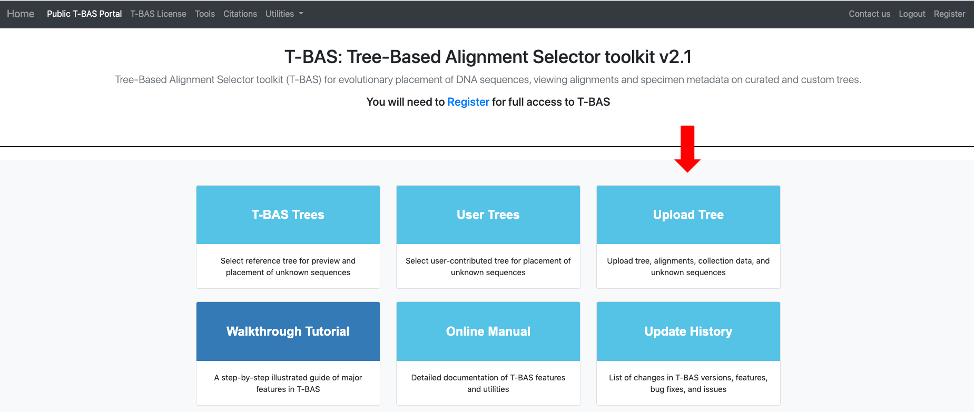
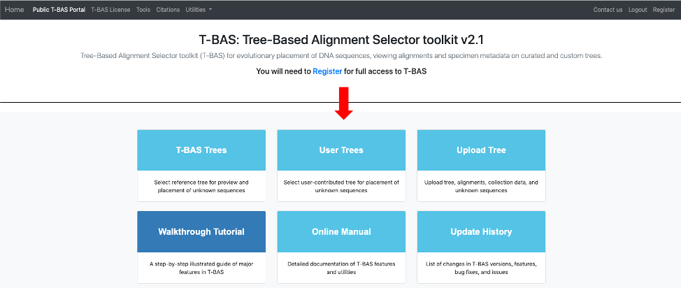
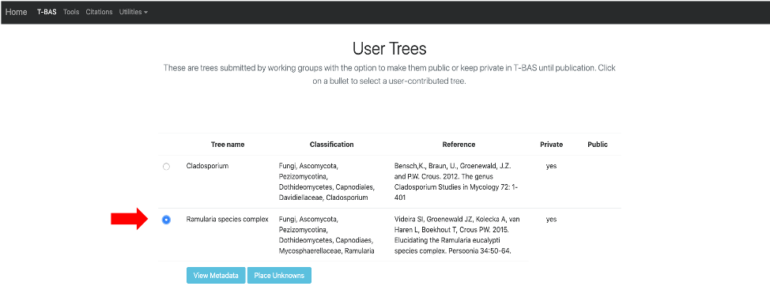

# Tutorial 4: Uploading and creating a custom T-BAS reference tree with alignments and specimen metadata

In this tutorial, the user will be uploading a custom reference tree, alignment and specimen metadata that are needed to perform a placement of unknown sequences on that tree. The user will use the *Ramularia* reference tree and files that are available in [TreeBase](https://www.treebase.org/treebase-web/search/studySearch.html). For your convenience we made these files available as links in the tutorial. They can also be downloaded by searching for the S16754 study ID in [TreeBase](https://www.treebase.org/treebase-web/search/studySearch.html) and retrieving the original [tree](//purl.org/phylo/treebase/phylows/tree/TB2:Tr79968?format=nexus) and [alignment](https://www.treebase.org/treebase-web/search/downloadANexusFile.html?id=16754&treeid=79968) files. The specimen metadata was extracted from Table 1 in [Videira et al. 2015](https://www.ncbi.nlm.nih.gov/pmc/articles/PMC4510271/). 

1. To begin, go to the [T-BAS start page](https://vclv99-239.hpc.ncsu.edu/tbas2_1/pages/tbas.php) and click on the **Upload Tree** button.

2. There are two options for uploading trees: Newick tree or Metadata Enhanced PhyloXML (MEP) file. The Newick format is for the tree only and selecting this option will expand the window to allow you to upload the sequence alignment and specimen metadata for the reference tree. MEP is a new data standard that extends phyloXML to include both sequence alignments and specimen metadata. MEP makes it convenient to place on trees from previous T-BAS runs because only one file needs to be uploaded. To begin, click on Newick tree (see arrow).

3. This will expand the display to show three upload sections: **Upload reference tree, Upload reference sequence alignment** and **Upload reference metadata**.  Click on the example file links (see arrows) for each section to load the files.

4. The example files will now be visible and can be edited.  If you have no edits you can skip to step 11. Some minor edits will be made to the Nexus sequence alignment file. To see more of the alignment file, click and drag down the corner box (see arrow).

5. The expanded window will look as shown below.  Click in the box and search for “locus” in your browser (Control+F, or Command+F on a Mac).

6. The search will highlight the loci that are defined in the character partition block and preceded by “charset” (see arrow). If we make no changes the loci will be labeled as locus1, locus2, locus3, locus4, locus5 and locus6 in T-BAS. These names make it difficult to track these loci when performing placements and retrieving data. In this example, the actual name of the locus is provided at the end of the charset line. For example, for locus1 the name is RPB2. Note all locus designations in the alignment file (highlighted in yellow and orange) will need to be relabeled – see next step.

7. Here are the relabeled loci. T-BAS can now correctly track the loci and the user will know which target locus to select when performing a placement (see Tutorial 5).

8. Scroll to the next section where you will be able to view the reference files or perform a phylogeny-based placement using those files. Whenever uploading a new dataset in T-BAS first view the files to make sure they are imported correctly.  Specify the outgroup as **Ramularia_nyssicola_CBS_127665** as shown below. Leave the default of **no** for phylogenetic analysis (see arrow) and then click **Submit**.

9. After the run is done, the results will be summarized in the browser and an email will be sent. The user will be able to download a **MEP** file with all the reference files to use in future placements. The option to **Add to T-BAS portal** is available to make the reference set available to others. These options will be described below but first view the tree to make sure all looks correct.

10. Below is the tree resized and formatted with the following options selected:  
    **Zoom** 0.5220   
    **Font size** +6  
    **Colorize Leaves** by Species  
    Branch **Width** 2  
    The **branch lengths** are drawn to scale.   

    The legend is displayed in the dashboard window on the right. The displayed colors may be different than what is shown in other runs.  
    

    The tree can also be viewed in Rectangular mode with the branch lengths drawn to scale as shown below.  Note the taxa names and attributes are shown at the tips of the branches.  
    

    The tree can also be viewed with the taxa names and attributes aligned by selecting the “align names” and “align attributes” checkboxes, as shown below. 
    

    Additional attributes can be displayed as bands in the tree by clicking on the box for “Colorize band 2” and selecting the desired attribute (on the left side panel). A legend for the new attribute appears in the dashboard window on the right.
    

11. Once the tree has been verified for correctness, download the **MEP** file.

12. This step shows how to use a **MEP** file to upload a tree. Go back to Upload Tree from the homepage and select the **MEP** option (see arrow), upload the **MEP** file downloaded from the previous step, and click submit.

13.  After the run is complete, click on **View tree**. As you can see below the **MEP** file contains the tree, alignments (six labeled loci) and specimen metadata. If you want to use this reference set in the future, you will just upload this **MEP** file.  

    This tree is resized and formatted with the following options selected:   
    **Zoom** 0.5220   
    **Font size** +6  
    **Colorize leaves** by Species  
    Branch **Width** 2   
    The **branch lengths** are drawn to scale.   

    The legend is displayed in the dashboard window on the right.
    

14. To add this reference set to the T-BAS portal select the **Add to T-BAS portal** link.

15. The following form will appear.

16. Here is an example of the form filled out. Note this tree is **private** and shared with only two other people (email list); if you want to make it **public** change the selection in the **Access level**. Click submit at the bottom of the form.

17. Once your tree has been reviewed by T-BAS admin it will be made available for viewing and placement by clicking on **User Trees** on the T-BAS start page. You will receive an email notification of the status of your submitted tree and when it is available for use in T-BAS.  

The Ramularia species complex tree will be listed under User Trees and available for viewing reference data files or placing unknowns by clicking on the bullet. 

