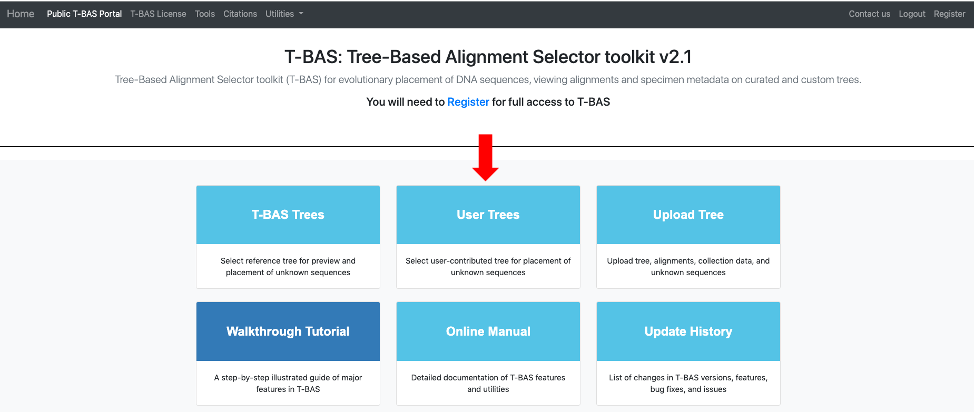
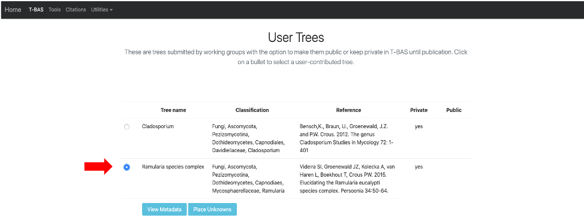
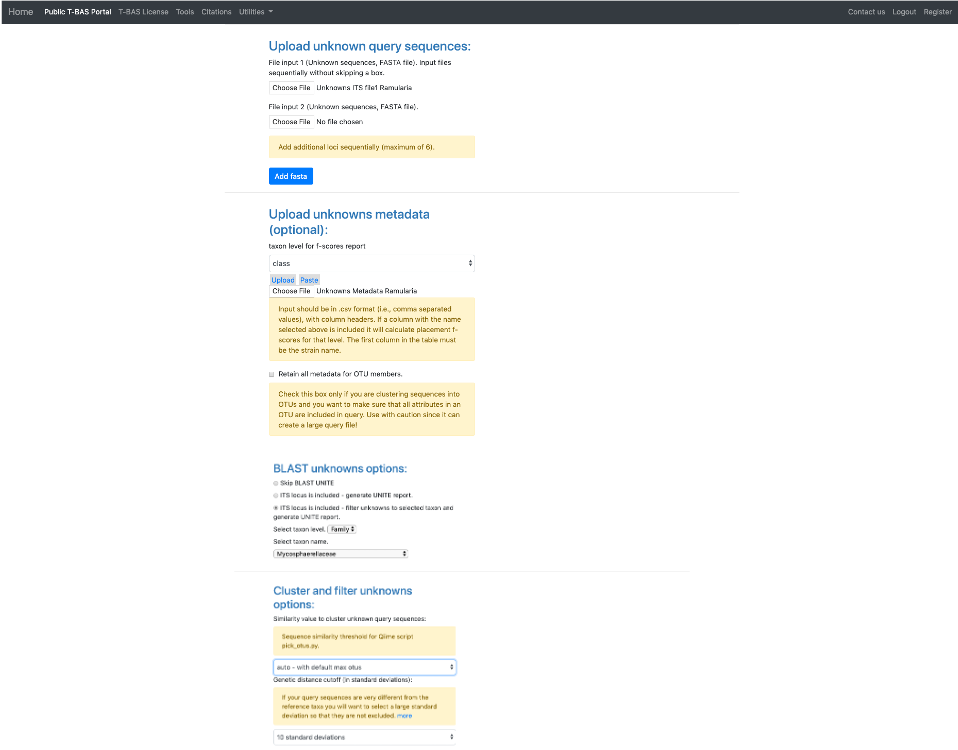
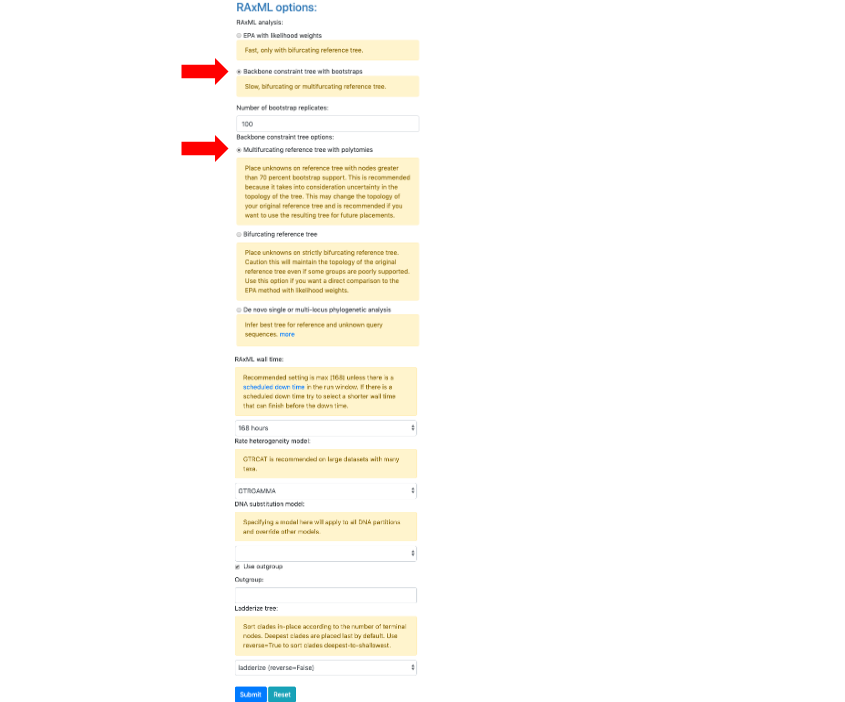
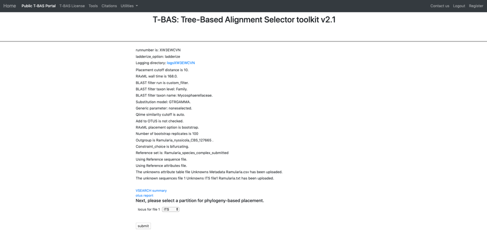
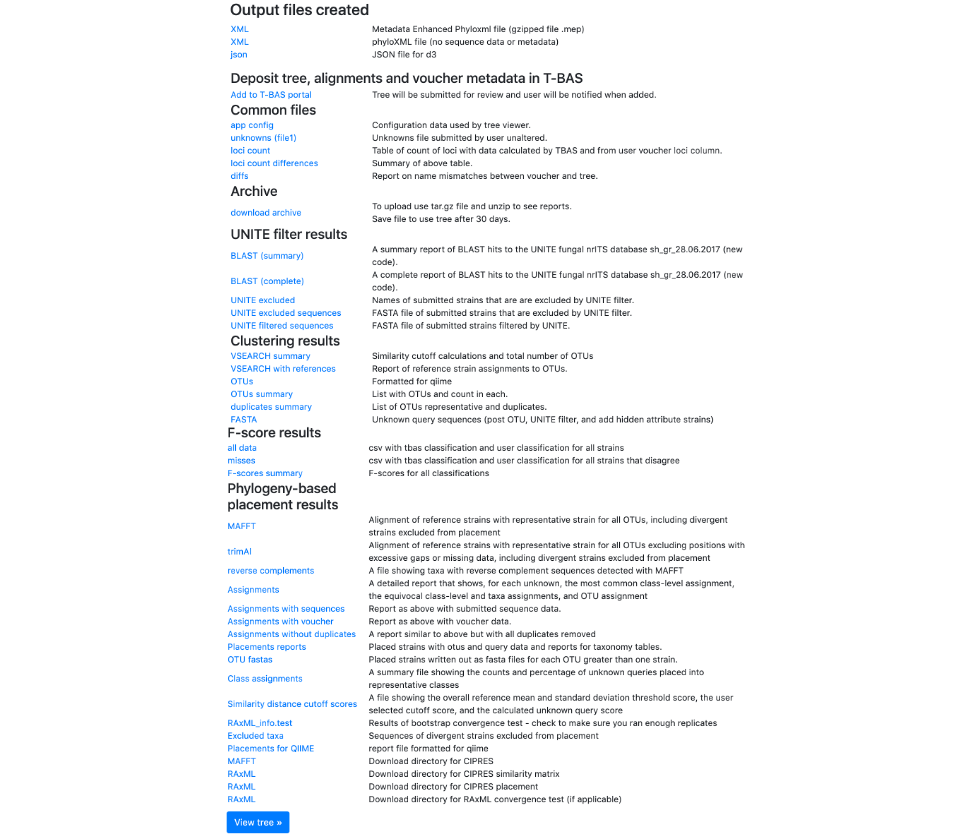
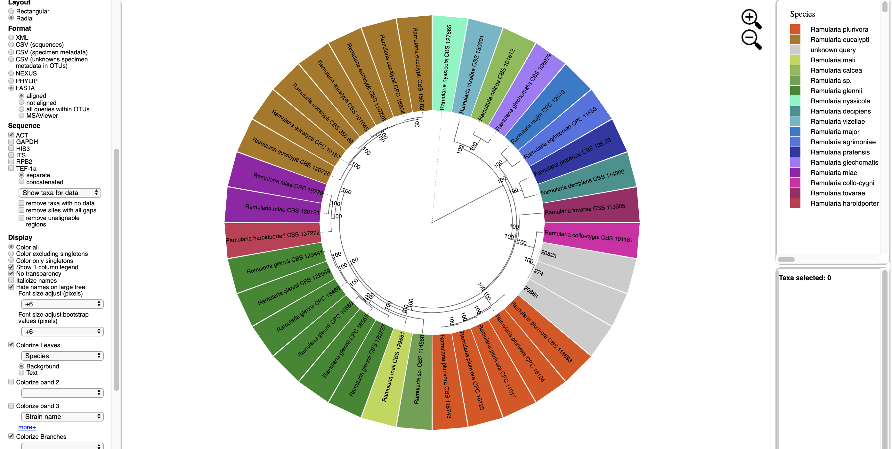

# Tutorial 5: Phylogeny-based placement of unknown sequences and specimen metadata on a custom reference tree

In this tutorial, the custom reference tree that was created in Tutorial 3 will be used to illustrate how unknowns can be examined using phylogeny-based placement. 
 
1. Before beginning the tutorial, download these two example files: [Unknowns ITS file1](https://vclv99-239.hpc.ncsu.edu/tbas2_1/pages/data/tbas-tutorial/its_sequences_set1.fasta) and [Unknowns metadata](https://vclv99-239.hpc.ncsu.edu/tbas2_1/pages/data/tbas-tutorial/Metadata-Unknowns.csv). Then go to the [T-BAS start page](https://vclv99-239.hpc.ncsu.edu/tbas2_1/pages/tbas.php) and click on User Trees.  

    This page will list all of the uploaded user trees. Click on the Ramularia species complex tree. After clicking on the bullet for Ramularia species complex, the buttons to View Metadata or Place Unknowns will be visible. Click on Place Unknowns.

2. Upload the downloaded Unknown ITS file1 Ramularia in the Upload unknown query sequences section and the Unknown Metadata Ramularia in the Upload unknowns metadata (optional) section. In the BLAST unknown options section, select ITS locus is included - filter unknowns to selected taxon and generate UNITE report, Taxon level – Family, Taxon name – Mycosphaerellaceae. Select Backbone constraint tree with bootstraps, Multifurcating reference tree with polytomies and make sure the Use outgroup box is checked and leave everything else as default. Click Submit.

3. A new tab will open showing the selected options for the placement (ensure pop-ups are enabled. If not, enable them and then try again). From the pull-down window select ITS and then hit submit.

4. Once the run is complete, the results page will look like this. An email will also be sent with the same information. Click on View Tree.

5. Here is the tree with the following options selected:   
    Zoom 0.6260  
    Font size +6  
    Font size adjust bootstrap +6  
    Colorize leaves by Species  
    Branch Width 2  
    The branch lengths are drawn to scale  
    Bootstrap values box is checked.  

    The legend is displayed in the dashboard window on the right.   

    All of the unknown sequences are identified as Ramularia collo-cygni. 
