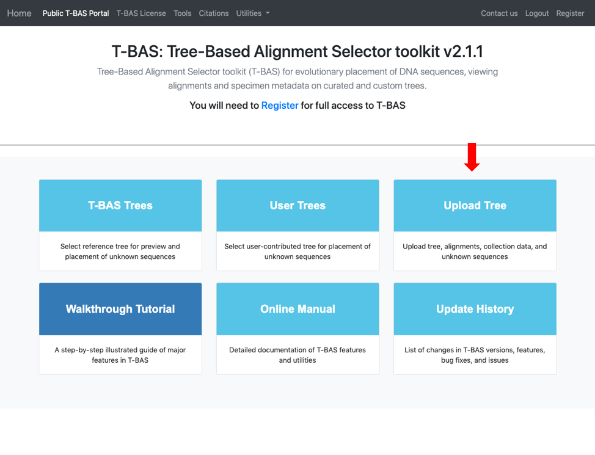

# Tutorial 6: Using MEP to cumulatively update trees

1. T-BAS can be used to perform consecutive placements on the same tree. This is useful to build on a previous placement run with additional sequence data. To start, go to the T-BAS start page and click on the Upload Tree button.
