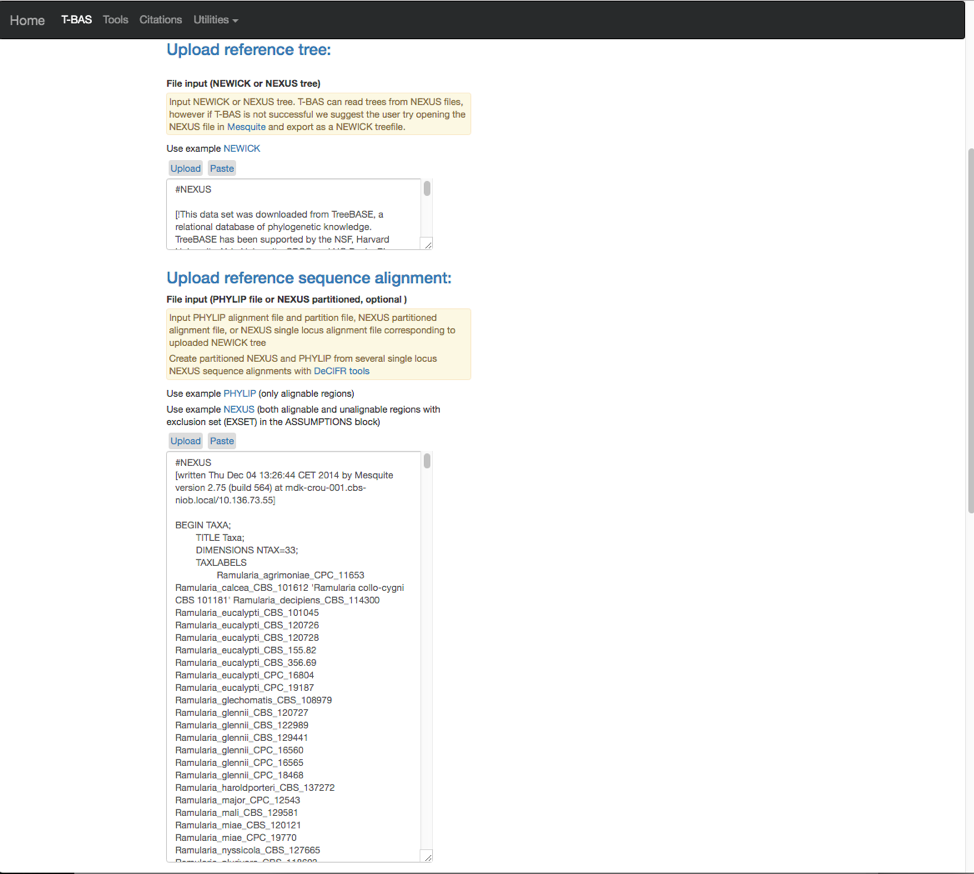

# Tutorial 6: Using MEP to cumulatively update trees

1. T-BAS can be used to perform consecutive placements on the same tree. This is useful to build on a previous placement run with additional sequence data. To start, go to the T-BAS start page and click on the Upload Tree button.

2. Select Newick tree

3. This will expand the display to show three upload sections: Upload reference tree, Upload reference sequence alignment and Upload reference metadata.  Click on the example file links (see arrows) for each section to load the files.

4. The example files will now be visible and can be edited. Some minor edits will be required to the Nexus sequence alignment file. To see more of the alignment file, click and drag down the corner box (see arrow).

5. The expanded window will look as shown below.  Click in the box and search for “locus” in your browser (Control+F, or Command+F on a Mac).

6. The search will highlight the loci that are defined in the character partition block and preceded by “charset” (see arrow). If no changes are made, the loci will be labeled as locus1, locus2, locus3, locus4, locus5 and locus6 in T-BAS. These names make it difficult to track these loci when performing placements and retrieving data. In this example, the actual name of the locus is provided at the end of the charset line. For example, for locus1 the name is RPB2. Note all locus designations in the alignment file (highlighted in yellow and orange) will need to be relabeled – see next step.

