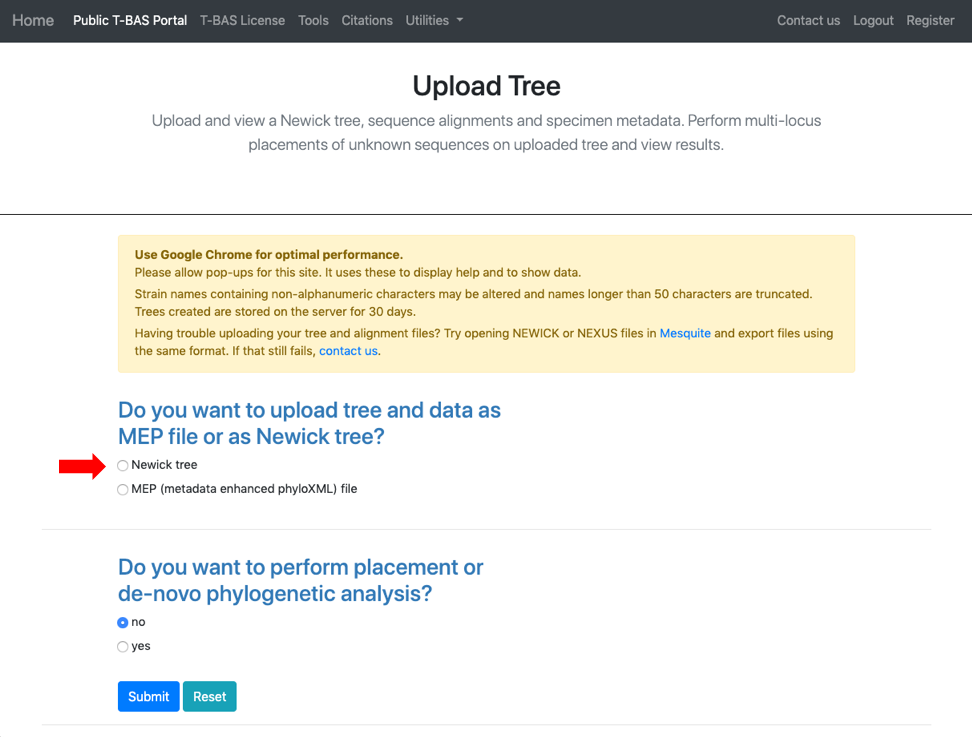
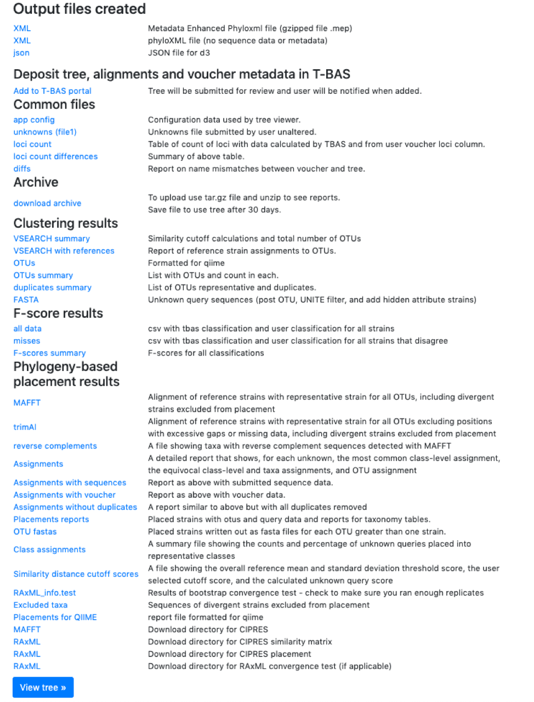
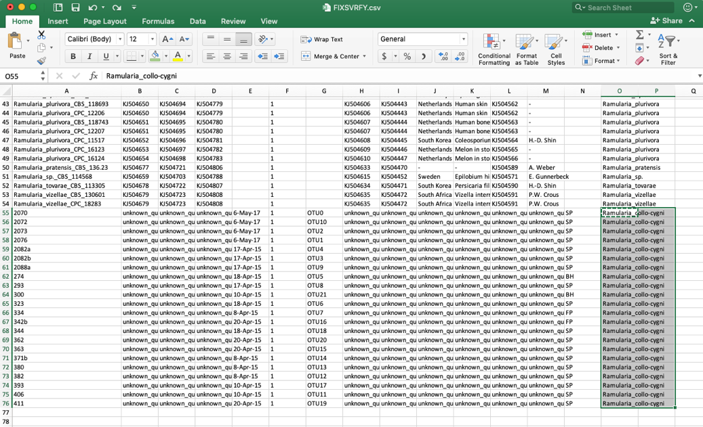

# Tutorial 6: Perform phylogeny-based placement using a user-uploaded Newick tree or Metadata Enhanced PhyloXML (MEP) file

**Main Contents**
[Step 1](#step1): Uploading a tree using Newick file
[Step 13](#step13): Updating specimen metadata
[Step 21](#step21): Upload unknown data on tree using MEP file

1. T-BAS can be used to perform consecutive placements on the same tree. This is useful to build on a previous placement run with additional sequence data. To start, go to the [T-BAS start page](https://tbas.vcl.ncsu.edu/tbas2_3/pages/tbas.php) and click on the **Upload Tree** button.

2. Select **Newick tree**

3. This will expand the display to show three upload sections: **Upload reference tree, Upload reference sequence alignment and Upload reference metadata**.  Click on the example file links (see arrows) for each section to load the files.

4. The example files will now be visible and can be edited. Some minor edits will be required to the Nexus sequence alignment file. To see more of the alignment file, click and drag down the corner box (see arrow).

5. The expanded window will look as shown below.  Click in the box and search for “locus” in your browser (Control+F, or Command+F on a Mac).

6. The search will highlight the loci that are defined in the character partition block and preceded by “charset” (see arrow). If no changes are made, the loci will be labeled as locus1, locus2, locus3, locus4, locus5 and locus6 in T-BAS. These names make it difficult to track these loci when performing placements and retrieving data. In this example, the actual name of the locus is provided at the end of the charset line. For example, for locus1 the name is RPB2. Note all locus designations in the alignment file (highlighted in yellow and orange) will need to be relabeled – see next step.

7. Here are the relabeled loci. T-BAS can now correctly track the loci and the user will know which target locus to select when performing a placement.

8. Scroll to the next section where you will be able to view the reference files or perform a phylogeny-based placement using those files. Whenever uploading a new dataset in T-BAS first view the files to make sure they are imported correctly. Specify the outgroup as **Ramularia_nyssicola_CBS_127665** as shown below. Select **yes** for phylogenetic analysis (see arrow) and then click **Submit**.

9. Select **Unknowns ITS file 1** and **Unknowns metadata** example files.

10. Ensure selections are selected as shown:

    Skip BLAST UNITE
    Skip-include all, no clustering
    Backbone constraint tree with bootstraps
    Multifurcating reference tree with polytomies
    Click **Submit**

    **IMPORTANT NOTE. If you cluster sequences, only the single representative sequence of the OTU will be in the tree for future placements on the tree.**

11. On the next page select the **ITS** partition for alignment of unknowns and click **Submit**

    Every run has a unique run number. This number will be used for associating results files with this specific run. The run number for this example is FIXSVRFY.

12. The run takes about 10 minutes to complete. Click **View Tree** to see the placements.

13. Here is the tree with the following options selected:

    **Zoom** 0.6103
    **Font size** +6
    **Font size adjust bootstrap** +6
    **Colorize Leaves** by Species
    Branch **Width** 2
    The **branch lengths** are drawn to scale

    Next click the **Update Metadata** button to edit the attributes table.

14. Clicking the download button will download the current specimen metadata. Download and open the spreadsheet.

15. When the specimen metadata is downloaded, it will be a CSV file named as the run number (in this example, FIXSVRFY.csv). Sort the spreadsheet by Species so that all of the unknowns are grouped together (unknown_query).

16. Edit these unknown_query entries in the species column to match what was shown in the placement tree, which was *Ramularia_collo-cygni*.  If the unknown sequences were not placed with high confidence (i.e. cumulative likelihood weights > 0.96), then the user might want to assign them to a higher taxonomic scale (e.g. genus) where there is more placement confidence. This file can be saved using the same name or it can be renamed, if desired. The changes will only be saved on the user’s local computer.

17. Go back to the Update Attributes page where the current specimen metadata was downloaded from and **Upload** the __edited__ specimen metadata. The edited file could also be copied and pasted into the field, if desired. Click **Submit**.

18. Once the run is complete, click **View tree**.

19. A new tree is created with the edited values. All of the unknowns are now labeled as *Ramularia_collo-cygni* and the leaves are colored accordingly.

20. Go back to the results page on step 18 and download the MEP file.
The new file is named FIXSVRFY_edit.mep.gz. This file contains the updated phylogenetic tree and specimen metadata that will be used to upload and place new unknown sequences.

21. Return to the T-BAS start page (from step 1) and select **Upload Tree**. Click on **MEP** and upload the downloaded XML file from step 20. Use Ramularia_nyssicola_CBS_127665 as the outgroup. Select **yes** in the placement section and select the **Unknowns ITS file2** example file.

22. Click on the **Unknowns metadata** example file. T-BAS can filter spurious ITS sequences using BLAST of the UNITE database. In the BLAST unknowns options section select **ITS locus is included – filter unknowns to selected taxon and generate UNITE report**. Then select the next highest taxonomic level for filtering – in this example, select the family _Mycosphaerellaceae_ as shown below. In the Cluster and filter unknowns options section, select **skip-include all, no clustering**.

23. In the RAxML options section, change the selection to **Backbone constraint tree with bootstraps** and **Multifurcating reference tree with polytomies**. Note that when placements are performed using EPA there will be multifurcations in the resulting tree and in subsequent placements only the backbone constraint method can be used. Click **Submit**.

24. Select the **ITS** locus file then click **submit**.

25. The placement will take about 5-10 minutes to run.
Notice the new run number: RSJZ7QDJ. All of the files downloaded will contain this run number.

26. Once the run is complete, the results page will display. Select **View tree** to see the tree.

27. The tree created by the second run is displayed using the following selections:

    **Zoom**: 0.8282
    **Font size**: +6
    **Font size adjust bootstrap**: +6
    **Colorize Leaves** by Species
    Branch **Width**: 2
    The **branch lengths** are drawn to scale

28. Clicking on update metadata on the tree (as shown in step 15) and downloading (as shown in step 16) will pull up the new specimen metadata file. Sort the file by species. Now the edits made in step 16 are shown here.

   Scroll to the bottom and the new unknown placements are listed. You can rename these and continue performing more placements on the same tree, as described above.

