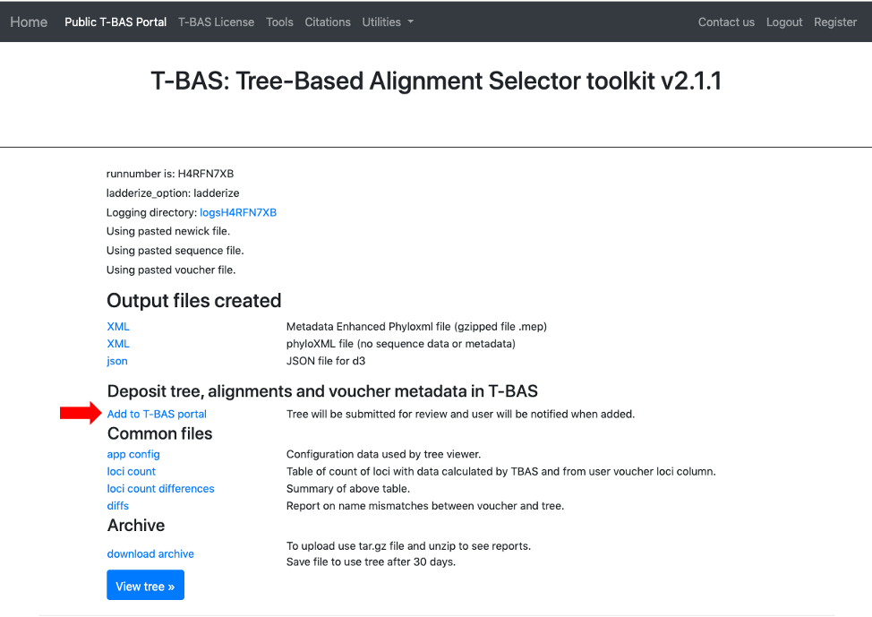
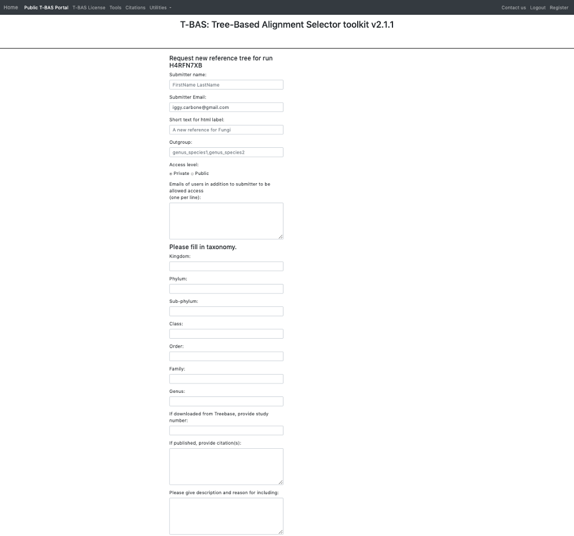
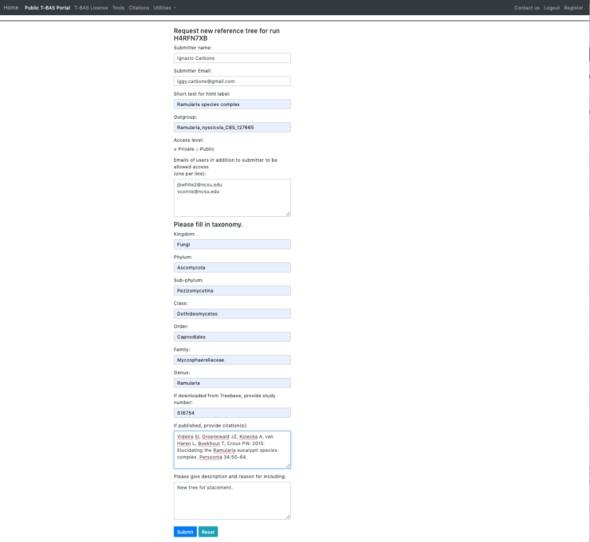
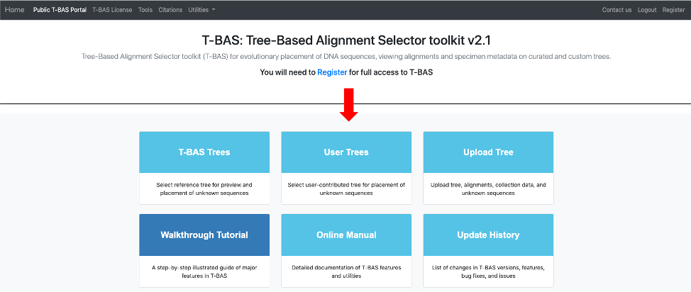
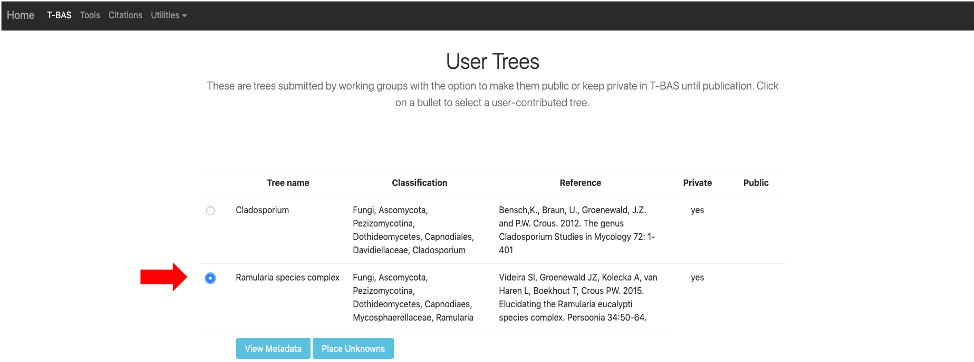

# Tutorial 7: Submit a MEP file for inclusion in T-BAS portal

14. To add this reference set to the T-BAS portal select the **Add to T-BAS portal** link.

15. The following form will appear.

16. Here is an example of the form filled out. Note this tree is **private** and shared with only two other people (email list); if you want to make it **public** change the selection in the **Access level**. Click **Submit** at the bottom of the form.

17. Once your tree has been reviewed by T-BAS admin it will be made available for viewing and placement by clicking on **User Trees** on the T-BAS start page. You will receive an email notification of the status of your submitted tree and when it is available for use in T-BAS.  

The *Ramularia* species complex tree will be listed under **User Trees** and available for viewing reference data files or placing unknowns by clicking on the bullet. 

