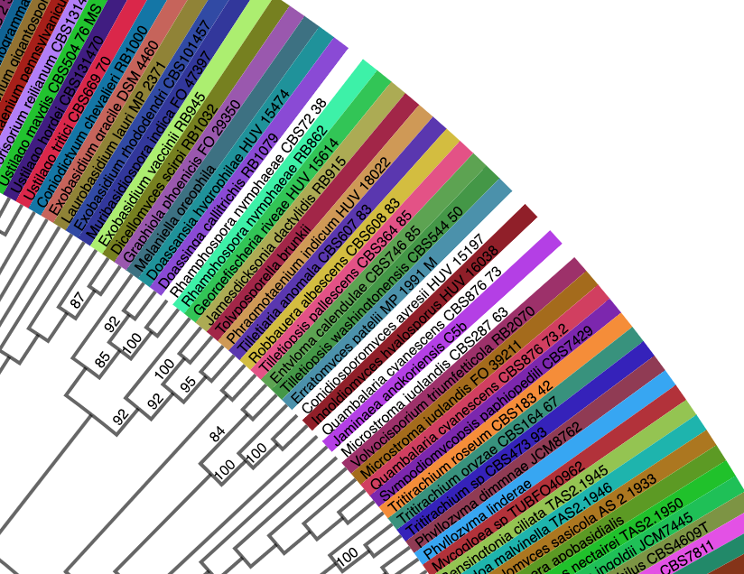
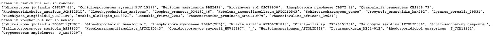
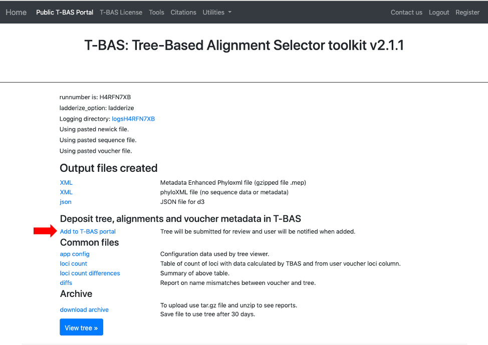
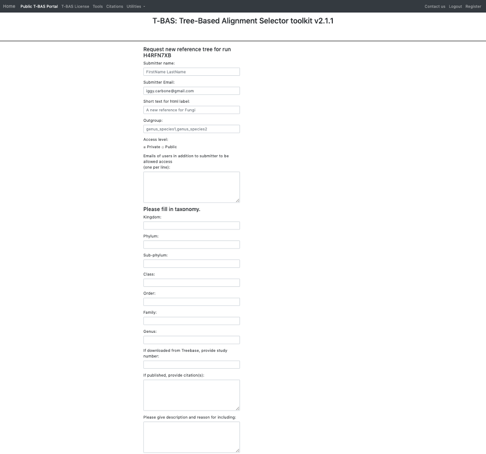
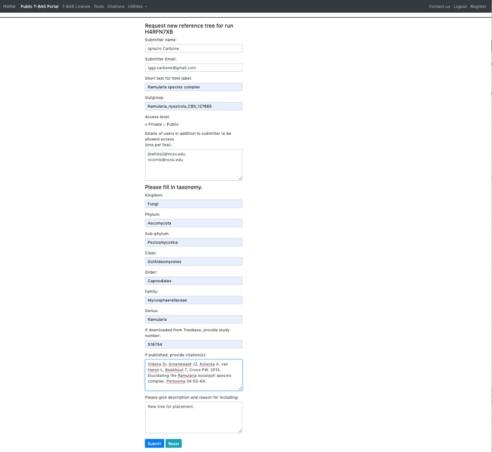
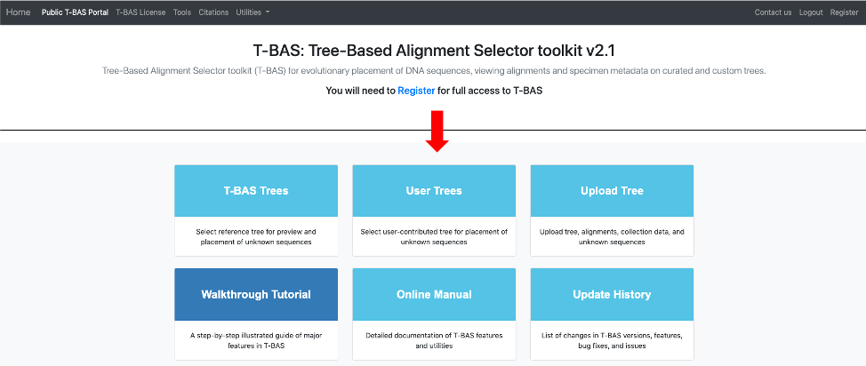

# Tutorial 7: Submit a MEP file for inclusion in T-BAS portal

This tutorial demonstrates how to add a custom tree to the T-BAS portal. This particular example is a continuation of Tutorial 6 but the steps apply to any completed tree run.

1. Before requesting to add a custom tree to the portal, inspect the tree to ensure that the taxon names match across uploaded files. If they do not match, the taxon names shown at the tips of the tree will be white, as shown in the example below.

This can also be checked by viewing the **diffs** file in the tree run. This file shows name mismatches between the metadata (voucher) and tree files.

2. Once it is confirmed that all names match, the new tree can then be added to the T-BAS portal. Select the **Add to T-BAS portal** link.

3. The following form will appear.

4. Here is an example of the form filled out. Note this tree is **private** and shared with only two other people (email list); if you want to make it **public** change the selection in the **Access level**. Click **Submit** at the bottom of the form.

5. Once your tree has been reviewed by T-BAS admin it will be made available for viewing and placement by clicking on **User Trees** on the T-BAS start page. You will receive an email notification of the status of your submitted tree and when it is available for use in T-BAS.  

The *Ramularia* species complex tree will be listed under **User Trees** and available for viewing reference data files or placing unknowns by clicking on the bullet. 

